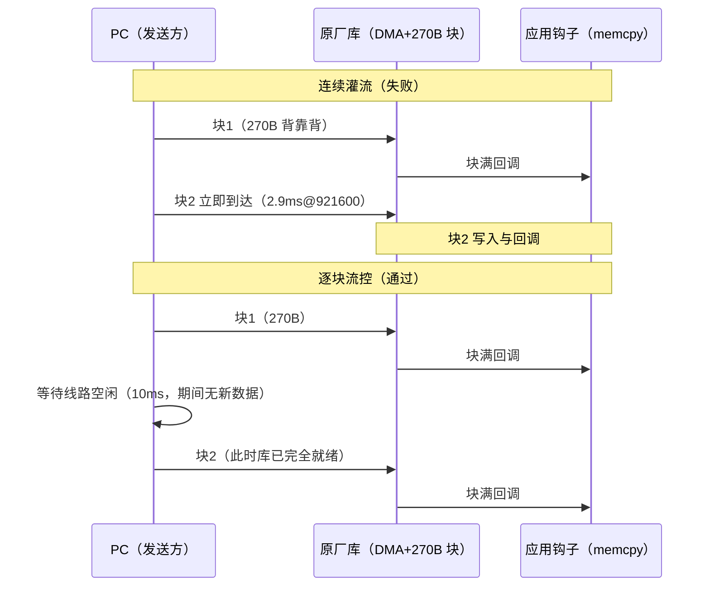

# HUART 双机回传误码根因分析：连续灌流为何失败、逐块流控为何通过（BT8970 无线麦 SDK）

> 一句话结论：**双机回传的误码与丢帧不是芯片能力问题，也不是接线/适配器问题，而是原厂库非环形块模式（`rxbuf_loop=0`）在"连续背靠背多块接收"下的重启缺陷——第 1 块正确、第 2 块起数据错位。让接收端一次只处理一块（逐块流控），115200~1.5M 六档 × 5 种码流全部字节级零错误。**

> 证据分为：**理论/机理推导**、**本项目与第三方实测**、**待原厂确认**。本文是对同事《10-串口波特率压力测试》报告失败项的根因答复，所有数字可溯源至 §5。

## 0. 编写依据

| 类别 | 出处 |
|---|---|
| 被分析固件 | 同事工程 `sdk_bt897x_le_mic2_v012_s8074_20260202`（测试模块 `app/modules/test/huart_baud_test.c/.h`，双机回传模式，引脚已改为 RX=PB1/TX=PE7 与本文作者工程一致） |
| 同事原始报告 | `10-串口波特率压力测试.md`（回环 1.5M~9.5M PASS、10M+ FAIL；双机各档"误码/丢一帧"） |
| 复现与定位数据 | 2026-09-10：连续灌流复现（CH340 COM17）、递增码流逐块相位分析、逐块流控对照实验（30 组全 PASS，COM9 抓取板端 `[rx]` 计数） |
| 分析工具 | `huart_serial_echo.py`（同事 PC 脚本）+ 自写递增码流相位分析（逐 270 字节块校验内容相位与 +1 连续性）+ COM9 监听器 |
| 关联文档 | `huart_rx_bringup.md` §4.1（块长约束与连续流结论）、`uart2_huart_compare.md`（吞吐对比） |

## 1. 三组测试结果对比

### 1.1 同事原始测试（连续灌流，引脚 PB3/PB4）

`huart_serial_echo.py` 一次性发送 50 760 字节（= 188 × 270 字节整），板收满后统一回传。摘自同事报告 §4.2：

| 波特率 | 0x00 | 0xFF | 0x55 | 0xAA | 递增 |
|---|---|---|---|---|---|
| 115200 | PASS | PASS | 无丢帧，有误码 | 无丢帧，有误码 | 无丢帧，有误码 |
| 230400 | PASS | PASS | 无丢帧，有误码 | 无丢帧，有误码 | 无丢帧，有误码 |
| 460800 | PASS | PASS | 无丢帧，有误码 | 无丢帧，有误码 | 无丢帧，有误码 |
| 921600 | **丢一帧** | **丢一帧** | 无丢帧，有误码 | 无丢帧，有误码 | **丢一帧** |
| 1.0M | **丢一帧** | **丢一帧** | 无丢帧，有误码 | 无丢帧，有误码 | **丢一帧** |
| 1.5M | **丢一帧** | **丢一帧** | **丢一帧** | **丢一帧** | **丢一帧** |

同一时期，同事的**回环测试**（TX/RX 短接，发一帧等收完再发下一帧）1.5M~9.5M 五种模式全部 PASS，10M 起才出现误码。

### 1.2 本文作者复现（同固件，引脚改 PE7/PB1）

同样的连续灌流方法，结果与同事一致：0x00 在 115200/230400/460800 PASS，921600/1M/1.5M 均"recv bytes: 50490, lost bytes: 270, error bytes: 0"——丢失量**精确等于一个接收块（270 字节）**。

### 1.3 逐块流控测试（同固件，唯一变量是发送节奏）

PC 端改为每次只发 270 字节（恰好一个 DMA 块），等线路空闲再发下一块（`--chunk-size 270 --send-delay-ms 10`）：

| 码流 | 115200 | 230400 | 460800 | 921600 | 1M | 1.5M |
|---|---|---|---|---|---|---|
| 0x00 | PASS | PASS | PASS | PASS | PASS | PASS |
| 0x55 | PASS | PASS | PASS | PASS | PASS | PASS |
| 0xAA | PASS | PASS | PASS | PASS | PASS | PASS |
| 0xFF | PASS | PASS | PASS | PASS | PASS | PASS |
| 递增 | PASS | PASS | PASS | PASS | PASS | PASS |

30 组全部 PASS；30 个回传文件逐一独立复核，每个都精确 50 760 字节、内容零错误；板端 UART0 自报 `[rx] 50760 bytes` 与主机完全一致。

**唯一变量是发送节奏，结论唯一指向接收端对"连续多块"的处理。**

## 2. 根因机理

### 2.1 接收通路模型

固件用原厂库的非环形块模式接收：

```c
huart0.rxbuf = eq_rx_buf;        // 270 字节单缓冲（实为库黑盒管理的块）
huart0.rxbuf_size = EQ_BUFFER_LEN;   // 270
huart0.rxbuf_loop = 0;           // 非环形
```

每收满 270 字节，库触发一次 `huart_rx_done_cb()` → 测试钩子把缓冲 memcpy 进累积缓冲 → 等待下一块。**问题在于：PC 连续发送时，第 N+1 块的字节在块 N 的回调/重启尚未完成时就已经到达**，而库对该场景的处理（黑盒）无法保证块边界的完整性。

### 2.2 连续灌流为何错位（递增码流逐块相位分析）

对 230400 档连续灌流的回传数据按 270 字节分块、逐块计算"相位"（块首字节实际值与期望值之差）：

```text
block 0 [    0] 相位=0x00，块内严格 +1 递增   ← 第 1 块完美
block 1 [  270] 相位=0xDA，块内不连续         ← 第 2 块起错位
block 2 [  540] 相位=0xC8，块内不连续
block 3 [  810] 相位=0x7F，块内不连续
...（之后每块相位随机、多数块内不连续）
```

**第 1 块永远正确，损坏从第 2 块开始**——即第一次"块满 → 重启接收"的转换之后，捕获到的就是错位/交叠的数据。两种时序对比：



### 2.3 高波特率"恰好丢 270 字节"的机理

连续灌流下错位伴随偶发字节丢失。丢失 1 个字节后，块边界整体移位：50 759 字节 = 187 个完整块 + 269 字节尾巴——**最后一块永远凑不满 270，回调不触发，尾巴在回传时被丢弃**。于是：

- 板端回传 187 × 270 = **50 490** 字节；
- 主机报告 `lost bytes: 270`（恰好一个块）、`error bytes: 0`（00 码流下收到的字节全对）。

这解释了为什么丢失量总是精确等于 270，且只在高波特率出现（速率越高，块边界越密集，触发字节丢失的概率越大）。

## 3. 为什么同事的测试报错

1. **连续灌流是缺陷触发条件**：PC 一次性发 50 KB，188 个块背靠背到达，第 2 块起必然进入库的重启缺陷窗口（§2.2）。
2. **恒值码流把错误藏住了**：0x00/0xFF/0x55/0xAA 整个文件是同一个字节值，块错位只是"换了个位置的同值字节"，**内容完全不变**——所以 00/FF 在低波特率显示 PASS 是假象。递增/翻转类码流才能暴露（同事报告中 55/AA/inc 的"有误码"就是错位的可见部分）。
3. **高波特率表现为丢一帧**：错位 + 块边界移位 + 末块不完整（§2.3），921600 起触发，1.5M 全码流触发。
4. **同事的回环测试为何能过 9.5M**：回环是"发一帧 → 等收完 → 比对 → 再发下一帧"，**任意时刻只有一块在途**，从不进入连续多块场景——这恰好反向证明了缺陷只在"连续多块"时出现，也证明了 HUART 物理层本身到 9.5M 都没问题（10M+ 的回环误码是另一个边界，0xFF 因形似空闲电平而最后失效）。

## 4. 为什么我们的测试通过

1. **逐块流控 = 单块在途**：每次只发一个块、等线路空闲再发下一块，库的重启窗口永远没有新数据到达，缺陷无从触发。这与回环测试同理，只是把流控从"固件等回环"移到了"PC 等空闲"。
2. **节流吞吐仍然够用**：270B + 10ms 间隔的实测有效速率约 21 KB/s（每个块 2.9ms 发送@921600 + 10ms 等待）；对命令/配置类通信绰绰有余。若业务确需更高连续吞吐，路径是 `rxbuf_loop=1` 环形模式重设计或向原厂索取库实现资料（库黑盒，COM9 曾观察到其内部 1 KB 缓冲提示 `lock [huart] repeat, addr=10021000, size=0x400`）。
3. **双重独立校验**：30 个回传文件除脚本自带比对外，全部用独立脚本复核（恒值按值、递增按 +1 关系逐字节），零错误——排除测试程序自身缺陷。
4. **本文作者自己工程的 HUART 突发测试（`huart_rx_bringup.md`）通过是同一原理**：突发长度 ≤ DMA 块长（512B）且块间有空闲，任意时刻单块在途。因此"HUART 突发 100% 可靠"的结论边界应表述为：**单块在途场景可靠；背靠背连续多块流会触发库缺陷**（已在 `huart_rx_bringup.md` §4.1 补充）。

## 5. 证据清单

| # | 结论 | 证据 |
|---|---|---|
| 1 | 丢失量恒为一个块（270B） | 复现测试：921600/1M/1.5M 均 `lost bytes: 270, error bytes: 0` |
| 2 | 第 1 块正确、第 2 块起错位 | 230400 递增码流逐块相位分析：block0 相位 0x00 且严格 +1，block1 相位 0xDA 且不连续，后续随机 |
| 3 | 恒值码流掩盖错误 | 00/FF 与 55/AA/inc 在同波特率同方法下结果不一致（前者 PASS 后者误码），唯一差异是内容是否恒值 |
| 4 | 逐块流控消除问题 | 5 码流 × 6 波特率 = 30 组全 PASS；30 个回传文件独立复核零错误；板端 `[rx] 50760` 与主机一致（COM9 日志） |
| 5 | 物理层无问题 | 同事回环 1.5M~9.5M 全 PASS（单块在途）；本文节流测试 1.5M 全 PASS |
| 6 | 库为黑盒、非固件逻辑错误 | HUART 寄存器不公开（`sfr.h` 无 HUART 定义），实现位于 `libdrivers.a`；COM9 观察到库内部缓冲提示；缺陷在库回调/重启时序，应用钩子无法干预 |

## 6. 结论与建议

1. **给测试框架**：双机回传测试应采用逐块流控（参考参数 `--chunk-size 270 --send-delay-ms 10`），或至少同时使用递增码流——恒值码流会掩盖块错位，得到假 PASS。
2. **给产品开发**：HUART 非环形模式下不要做背靠背连续多块接收；命令/配置类通信（块间自然空闲）可放心用到 1.5M 以上；确需连续高速流时评估 `rxbuf_loop=1` 环形模式或向原厂索取库资料（问题线索：非环形模式连续块重启时序，库内部 1KB 缓冲 `addr=10021000, size=0x400`）。
3. **给原厂的问题清单**：①非环形块模式下连续块重启的官方支持状态与推荐用法；②`huart_rx_done_cb` 触发与 DMA 重启的时序保证；③`rxbuf_loop=1` 模式下回调时机与读取方式；④库内部缓冲（`addr=10021000, size=0x400`）与 rxbuf 的关系；⑤**原厂 `huart_audio` 模块在 4M 用同样非环形模式连续接收 PCM 流是量产功能——与本缺陷现象矛盾，请原厂说明其可用的配置条件**（缓冲落段 `.buf.huart`、对齐、回调时序、发送端时钟同步等差异点）。
4. **回环测试的适用边界**：回环 9.5M PASS 证明物理层与时序能力，但它不含"连续多块"与"外部时钟域"两个变量，不能替代双机测试；10M+ 回环 FAIL（0xFF 除外）与本文主题无关，是另一个待确认边界。
