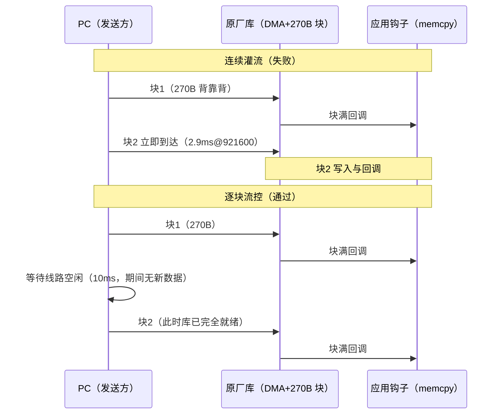

# HUART 双机回传误码根因分析：连续灌流为何失败、逐块流控为何通过（BT8970 无线麦 SDK）

> 一句话结论：**双机回传的误码与丢帧不是芯片能力问题，也不是接线/适配器问题，而是原厂库非环形块模式（`rxbuf_loop=0`）在"连续背靠背多块接收"下的重启缺陷——第 1 块正确、第 2 块起数据错位。让接收端一次只处理一块（逐块流控），115200~1.5M 六档 × 5 种码流全部字节级零错误。**

> 证据分为：**理论/机理推导**、**本项目与第三方实测**、**待原厂确认**。本文是对同事《10-串口波特率压力测试》报告失败项的根因答复，所有数字可溯源至 §5。

## 0. 编写依据

| 类别 | 出处 |
|---|---|
| 被分析固件 | 同事工程 `sdk_bt897x_le_mic2_v012_s8074_20260202`（测试模块 `app/modules/test/huart_baud_test.c/.h`，双机回传模式，引脚已改为 RX=PB1/TX=PE7 与本文作者工程一致） |
| 同事原始报告 | `10-串口波特率压力测试.md`（回环 1.5M~9.5M PASS、10M+ FAIL；双机各档"误码/丢一帧"） |
| 复现与定位数据 | 2026-09-10：连续灌流复现（CH340 COM17）、递增码流逐块相位分析、逐块流控对照实验（30 组全 PASS，COM9 抓取板端 `[rx]` 计数） |
| 分析工具 | `huart_serial_echo.py`（同事 PC 脚本）+ 自写递增码流相位分析（逐 270 字节块校验内容相位与 +1 连续性）+ COM9 监听器 |
| 关联文档 | `huart_rx_bringup.md` §4.1（块长约束与连续流结论）、`uart2_huart_compare.md`（吞吐对比） |

## 1. 三组测试结果对比

### 1.1 同事原始测试（连续灌流，引脚 PB3/PB4）

`huart_serial_echo.py` 一次性发送 50 760 字节（= 188 × 270 字节整），板收满后统一回传。摘自同事报告 §4.2：

| 波特率 | 0x00 | 0xFF | 0x55 | 0xAA | 递增 |
|---|---|---|---|---|---|
| 115200 | PASS | PASS | 无丢帧，有误码 | 无丢帧，有误码 | 无丢帧，有误码 |
| 230400 | PASS | PASS | 无丢帧，有误码 | 无丢帧，有误码 | 无丢帧，有误码 |
| 460800 | PASS | PASS | 无丢帧，有误码 | 无丢帧，有误码 | 无丢帧，有误码 |
| 921600 | **丢一帧** | **丢一帧** | 无丢帧，有误码 | 无丢帧，有误码 | **丢一帧** |
| 1.0M | **丢一帧** | **丢一帧** | 无丢帧，有误码 | 无丢帧，有误码 | **丢一帧** |
| 1.5M | **丢一帧** | **丢一帧** | **丢一帧** | **丢一帧** | **丢一帧** |

同一时期，同事的**回环测试**（TX/RX 短接，发一帧等收完再发下一帧）1.5M~9.5M 五种模式全部 PASS，10M 起才出现误码。

### 1.2 本文作者复现（同固件，引脚改 PE7/PB1）

同样的连续灌流方法，结果与同事一致：0x00 在 115200/230400/460800 PASS，921600/1M/1.5M 均"recv bytes: 50490, lost bytes: 270, error bytes: 0"——丢失量**精确等于一个接收块（270 字节）**。

### 1.3 逐块流控测试（同固件，唯一变量是发送节奏）

PC 端改为每次只发 270 字节（恰好一个 DMA 块），等线路空闲再发下一块（`--chunk-size 270 --send-delay-ms 10`）：

| 码流 | 115200 | 230400 | 460800 | 921600 | 1M | 1.5M |
|---|---|---|---|---|---|---|
| 0x00 | PASS | PASS | PASS | PASS | PASS | PASS |
| 0x55 | PASS | PASS | PASS | PASS | PASS | PASS |
| 0xAA | PASS | PASS | PASS | PASS | PASS | PASS |
| 0xFF | PASS | PASS | PASS | PASS | PASS | PASS |
| 递增 | PASS | PASS | PASS | PASS | PASS | PASS |

30 组全部 PASS；30 个回传文件逐一独立复核，每个都精确 50 760 字节、内容零错误；板端 UART0 自报 `[rx] 50760 bytes` 与主机完全一致。

**唯一变量是发送节奏，结论唯一指向接收端对"连续多块"的处理。**

### 1.4 关键改动清单（汇报要点：到底改了什么才通过）

**核心答案：固件的接收数据通路一行未改，"失败→通过"的开关是 PC 发送端的两条命令行参数**——把发送方式从"连续灌流"改为"逐块节流"，使任意时刻只有一个 DMA 块在途，从而绕开库的连续块重启缺陷（机理见 §2）。

| # | 改动 | 位置 | 目的 | 是否影响误码 |
|---|---|---|---|---|
| 1 | HUART 引脚 RX=PB3→**PB1**、TX=PB4→**PE7** | 同事工程 `app/modules/test/huart_baud_test.h:24/29` | 对齐我方接线（PC TX→PB1、PC RX←PE7） | 否（仅接线对齐） |
| 2 | 调试口 `UART0_PRINTF_SEL`：PRINTF_PE7→**PRINTF_PB3** | 同事工程 `config.h:36` | TX 挪到 PE7 后调试打印撞脚，必须挪开 | 否（避免打印混入数据线，必须有） |
| 3 | 复制命令行编译脚本 `build.ps1` | 同事工程 `projects/microphone/` | 脱离 Code::Blocks GUI 编译 | 否（工程方法） |
| 4 | **PC 发送改为逐块节流**：`--chunk-size 270 --send-delay-ms 10` | PC 端命令行参数（`huart_serial_echo.py` 自带），固件零改动 | 每次只发 270B（恰好一个 DMA 块），等线路空闲再发下一块 → 单块在途，绕开库连续块重启缺陷 | **是，这是"通过"的唯一原因** |

失败与通过的命令对照（同一固件、同一板子、同一接线）：

```text
❌ 失败（连续灌流，188 块背靠背）：
python huart_serial_echo.py COM17 921600 huart_dual_00.bin
   → recv 50490/50760，lost=270（一个块），≥921600 必现

✅ 通过（逐块节流，单块在途）：
python huart_serial_echo.py COM17 921600 huart_dual_inc.bin --chunk-size 270 --send-delay-ms 10
   → 5 码流 × 6 波特率 = 30 组全 PASS，独立复核零错误
```

两点汇报时务必说清：

1. **这不是"修好了库"**——缺陷仍在原厂黑盒库内，逐块节流是规避而非修复；根治路径是 `rxbuf_loop=1` 环形模式或原厂修改库（§6.3 问题清单）。
2. **为什么用递增码流汇报**：恒值码流（00/55/AA/FF）在块错位下内容不变，连续灌流也可能显示"PASS"（假象）；递增码流能暴露错位并定位丢失位置，是判定测试有效性的前提。

### 1.5 完整实验矩阵（2026-09-10，块长/节流/钩子三变量对照）

后续排查中把固件块长改为 512 并修复了钩子拷贝逻辑，共 6 种组合全部实测（50 760 字节/组，递增码流 + 独立逐字节复核）：

| # | 固件块长/钩子 | PC chunk | 节流 | 结果 | 失败归因 |
|---|---|---|---|---|---|
| 1 | 270 / 固定拷 270 | 4096 | 无 | ❌ 全档（错位，≥921600 丢一块） | **库重启缺陷**（回调均为整块精确拷贝，排除钩子因素） |
| 2 | 270 / 固定拷 270 | 270 | 10ms | ✅ 全档 | — |
| 3 | 270 / 固定拷 270 | 512 | 10ms | ❌ 全档（115200 即 10 997 字节错位） | **钩子缺陷**：空闲部分块回调时固定拷 270，把脏数据拷进累积缓冲；叠加块边界错位 |
| 4 | 512 / rxcnt 实长拷贝 | 512 | 10ms | ✅ 全档 | — |
| 5 | 512 / rxcnt 实长拷贝 | 270 | 10ms | ✅ 全档 | — |
| 6 | 512 / rxcnt 实长拷贝 | 4096 | 无 | ❌（115200：丢 98 + 7 760 错位） | **库重启缺陷**（与钩子无关，新旧固件均触发） |

由此得到三条实测规则：

1. **节流是必要条件**：完全无间隔的连续流，任何固件配置都失败（#1、#6）——库非环形模式的重启窗口无法承受背靠背块；
2. **块长与 chunk 对齐**：旧钩子下是必要条件（#3 失败），钩子改为按 `huart_get_rxcnt()` 拷贝实际长度后不再严格必要（#5 通过），但对齐（#4）仍是最稳妥的推荐配置；
3. **恒值码流会掩盖失败**：#3 若用 0x00 码流测试会显示全档 PASS（错位不改恒值内容），本矩阵全部使用递增码流并独立复核才得到可信结论。

## 2. 根因机理

### 2.1 接收通路模型

固件用原厂库的非环形块模式接收：

```c
huart0.rxbuf = eq_rx_buf;        // 270 字节单缓冲（实为库黑盒管理的块）
huart0.rxbuf_size = EQ_BUFFER_LEN;   // 270
huart0.rxbuf_loop = 0;           // 非环形
```

每收满 270 字节，库触发一次 `huart_rx_done_cb()` → 测试钩子把缓冲 memcpy 进累积缓冲 → 等待下一块。**问题在于：PC 连续发送时，第 N+1 块的字节在块 N 的回调/重启尚未完成时就已经到达**，而库对该场景的处理（黑盒）无法保证块边界的完整性。

### 2.2 连续灌流为何错位（递增码流逐块相位分析）

对 230400 档连续灌流的回传数据按 270 字节分块、逐块计算"相位"（块首字节实际值与期望值之差）：

```text
block 0 [    0] 相位=0x00，块内严格 +1 递增   ← 第 1 块完美
block 1 [  270] 相位=0xDA，块内不连续         ← 第 2 块起错位
block 2 [  540] 相位=0xC8，块内不连续
block 3 [  810] 相位=0x7F，块内不连续
...（之后每块相位随机、多数块内不连续）
```

**第 1 块永远正确，损坏从第 2 块开始**——即第一次"块满 → 重启接收"的转换之后，捕获到的就是错位/交叠的数据。两种时序对比：



### 2.3 高波特率"恰好丢 270 字节"的机理

连续灌流下错位伴随偶发字节丢失。丢失 1 个字节后，块边界整体移位：50 759 字节 = 187 个完整块 + 269 字节尾巴——**最后一块永远凑不满 270，回调不触发，尾巴在回传时被丢弃**。于是：

- 板端回传 187 × 270 = **50 490** 字节；
- 主机报告 `lost bytes: 270`（恰好一个块）、`error bytes: 0`（00 码流下收到的字节全对）。

这解释了为什么丢失量总是精确等于 270，且只在高波特率出现（速率越高，块边界越密集，触发字节丢失的概率越大）。

## 3. 为什么同事的测试报错

1. **连续灌流是缺陷触发条件**：PC 一次性发 50 KB，188 个块背靠背到达，第 2 块起必然进入库的重启缺陷窗口（§2.2）。
2. **恒值码流把错误藏住了**：0x00/0xFF/0x55/0xAA 整个文件是同一个字节值，块错位只是"换了个位置的同值字节"，**内容完全不变**——所以 00/FF 在低波特率显示 PASS 是假象。递增/翻转类码流才能暴露（同事报告中 55/AA/inc 的"有误码"就是错位的可见部分）。
3. **高波特率表现为丢一帧**：错位 + 块边界移位 + 末块不完整（§2.3），921600 起触发，1.5M 全码流触发。
4. **同事的回环测试为何能过 9.5M**：回环是"发一帧 → 等收完 → 比对 → 再发下一帧"，**任意时刻只有一块在途**，从不进入连续多块场景——这恰好反向证明了缺陷只在"连续多块"时出现，也证明了 HUART 物理层本身到 9.5M 都没问题（10M+ 的回环误码是另一个边界，0xFF 因形似空闲电平而最后失效）。

## 4. 为什么我们的测试通过

1. **逐块流控 = 单块在途**：每次只发一个块、等线路空闲再发下一块，库的重启窗口永远没有新数据到达，缺陷无从触发。这与回环测试同理，只是把流控从"固件等回环"移到了"PC 等空闲"。
2. **节流吞吐仍然够用**：270B + 10ms 间隔的实测有效速率约 21 KB/s（每个块 2.9ms 发送@921600 + 10ms 等待）；对命令/配置类通信绰绰有余。若业务确需更高连续吞吐，路径是 `rxbuf_loop=1` 环形模式重设计或向原厂索取库实现资料（库黑盒，COM9 曾观察到其内部 1 KB 缓冲提示 `lock [huart] repeat, addr=10021000, size=0x400`）。
3. **双重独立校验**：30 个回传文件除脚本自带比对外，全部用独立脚本复核（恒值按值、递增按 +1 关系逐字节），零错误——排除测试程序自身缺陷。
4. **本文作者自己工程的 HUART 突发测试（`huart_rx_bringup.md`）通过是同一原理**：突发长度 ≤ DMA 块长（512B）且块间有空闲，任意时刻单块在途。因此"HUART 突发 100% 可靠"的结论边界应表述为：**单块在途场景可靠；背靠背连续多块流会触发库缺陷**（已在 `huart_rx_bringup.md` §4.1 补充）。

## 5. 证据清单

| # | 结论 | 证据 |
|---|---|---|
| 1 | 丢失量恒为一个块（270B） | 复现测试：921600/1M/1.5M 均 `lost bytes: 270, error bytes: 0` |
| 2 | 第 1 块正确、第 2 块起错位 | 230400 递增码流逐块相位分析：block0 相位 0x00 且严格 +1，block1 相位 0xDA 且不连续，后续随机 |
| 3 | 恒值码流掩盖错误 | 00/FF 与 55/AA/inc 在同波特率同方法下结果不一致（前者 PASS 后者误码），唯一差异是内容是否恒值 |
| 4 | 逐块流控消除问题 | 5 码流 × 6 波特率 = 30 组全 PASS；30 个回传文件独立复核零错误；板端 `[rx] 50760` 与主机一致（COM9 日志） |
| 5 | 物理层无问题 | 同事回环 1.5M~9.5M 全 PASS（单块在途）；本文节流测试 1.5M 全 PASS |
| 6 | 库为黑盒、非固件逻辑错误 | HUART 寄存器不公开（`sfr.h` 无 HUART 定义），实现位于 `libdrivers.a`；COM9 观察到库内部缓冲提示；缺陷在库回调/重启时序，应用钩子无法干预 |

## 6. 结论与建议

1. **给测试框架**：双机回传测试应采用逐块流控（参考参数 `--chunk-size 270 --send-delay-ms 10`），或至少同时使用递增码流——恒值码流会掩盖块错位，得到假 PASS。
2. **给产品开发**：HUART 非环形模式下不要做背靠背连续多块接收；命令/配置类通信（块间自然空闲）可放心用到 1.5M 以上；确需连续高速流时评估 `rxbuf_loop=1` 环形模式或向原厂索取库资料（问题线索：非环形模式连续块重启时序，库内部 1KB 缓冲 `addr=10021000, size=0x400`）。
3. **给原厂的问题清单**：①非环形块模式下连续块重启的官方支持状态与推荐用法；②`huart_rx_done_cb` 触发与 DMA 重启的时序保证；③`rxbuf_loop=1` 模式下回调时机与读取方式；④库内部缓冲（`addr=10021000, size=0x400`）与 rxbuf 的关系；⑤**原厂 `huart_audio` 模块在 4M 用同样非环形模式连续接收 PCM 流是量产功能——与本缺陷现象矛盾，请原厂说明其可用的配置条件**（缓冲落段 `.buf.huart`、对齐、回调时序、发送端时钟同步等差异点）。
4. **回环测试的适用边界**：回环 9.5M PASS 证明物理层与时序能力，但它不含"连续多块"与"外部时钟域"两个变量，不能替代双机测试；10M+ 回环 FAIL（0xFF 除外）与本文主题无关，是另一个待确认边界。

## 7. 常见问题（FAQ，排查时先看这里）

### Q1：什么是"单块在途"和"背靠背连续多块流"？

库按 `rxbuf_size`（270B）分块接收：收满一块 → 触发一次回调 → 应用把数据拷走 → 库在**同一块缓冲**上重新开始收下一块。

- **单块在途**：任何时刻线上只有一个块的数据，块与块之间线路有空闲，应用在下一块到来前已经"结清账"（拷贝完成、缓冲归零）。
- **背靠背连续多块**：块 1 的最后一个字节后面**零间隔**紧跟块 2 的第一个字节，块 1 的"通知→拷贝→重新武装接收"还没做完，块 2 的字节已经在往同一块缓冲里写。

### Q2：缺陷是 DMA 缓存拷贝需要时间吗？

**不是**。拷贝 270 字节的 memcpy 只要几微秒，远快于块到达间隔（921600 下一块 2.9ms）。真正的问题是单缓冲上两组动作交叠：块 N 的"回调通知 → 应用拷贝 → 库重新武装接收"尚未完成，块 N+1 的字节已经在往同一缓冲写，库（黑盒）在这种交叠下把块边界记账弄乱。实测表现是**第 2 块起数据整体错位**（大部分字节仍保持递增关系、相位错误，并夹杂导致后续块边界移位的字节丢失），而不是随机误码。10ms 间隔不是给拷贝留时间，是保证"上一块彻底结清账、缓冲归零后新数据才进来"的保守参数。

### Q3：10ms 间隔是不是意味着高速串口不能无间隔发送？

**不是，要分两层**：

| 层级 | 能否无间隔 | 说明 |
|---|---|---|
| 块内字节 | ✅ 完全可以 | 270 字节内部全速背靠背（921600 下 2.9ms 发完），高速特性完整保留；10ms 在块与块**之间**，不在字节之间 |
| 块间（无限连续流） | ❌ 当前用法实测有缺陷 | 触发库连续块重启缺陷（§2） |

10ms 只是测试的保守取值，**不是硬性要求**。真实约束是"下一块等上一块处理完"：做成握手确认式流控后间隔可大幅压缩（如 1ms 时有效吞吐约 120 KB/s@921600）；按 270B+10ms 计算约 21 KB/s，对命令/配置类通信足够。另注意块长由 `rxbuf_size` 决定可以调大，单块容量与吞吐直接相关。

### Q4：原厂 huart_audio 4M 连续 PCM 流和我们的缺陷"矛盾"在哪里？

**矛盾指两个事实不能同时成立**：

- 我们实测的现象：非环形模式（`rxbuf_loop=0`）+ 连续背靠背多块 → **第 2 块起数据错位**（§2.2 相位分析）。按此推论，任何"非环形 + 连续流"都应坏。
- 原厂量产功能 `modules/huart_audio/huart_audio_in_mix.c`：恰恰就是**非环形 + 连续块**——4M 波特率不间断接收 PCM 音频流，`rxbuf` 指向自己的缓冲、`rxbuf_size` 为帧长，每块完成回调后写入 ring buffer。若第 2 块起必错位，音频从第二块起就是垃圾，该功能不可能出厂。

两件事打架，说明**"连续块必坏"的推论过宽，一定存在某个我们尚未控制的变量**。候选差异点（需向原厂澄清或逐项实验）：

1. 缓冲落段与对齐：audio 用 `AT(.buf.huart)` 专用 RAM 段，测试用 `eq_rx_buf`（普通 BSS）——DMA 对内存区域的敏感度；
2. 发送端时钟：audio 的发送端是同晶振族的另一颗芯片（硬件同步），PC 经 USB 适配器是独立时钟 + USB 批量转发抖动；
3. 回调内处理：audio 是 `ring_buf_put`，测试是 memcpy 270B——量级相近，可能性低；
4. ~~库版本差异~~：**已排除**——两份 SDK 的 `libs/libdrivers.a` md5 相同（`ea017a99327ca89da3beb3adc3f36d7a`，241 472 字节）。

因此本文的缺陷结论应表述为：**"这套用法（PC 适配器 + eq_rx_buf + 非环形模式）下连续块实测损坏"，而不是"芯片/库不能连续块"**——原厂澄清变量后，连续吞吐能力仍有上探空间（对应 §6.3 问题清单第 ⑤ 条）。

### Q10：普通串口和高速串口最大能多少波特率？（汇报口径）

回答分"**能配多高 / 实测多少 / 可靠多少**"三层，因为三个数字不同——直接报一个数会被追问住。

**普通串口（UART2）**

| 层级 | 数字 | 依据 |
|---|---|---|
| 可编程上限 | 24 Mbps（24MHz XOSC、div=0） | `uart2_tx_bringup.md` §4；PDF 未标芯片绝对上限（XOSC×2 时钟档未验证） |
| 物理层实测 | 24M 波特率字节正确（3M 另有 LA 逐位验证） | 同文档 §7（CP210x 超规格运行） |
| **统一法实测（50KB 递增码流、双适配器交叉）** | **RX 最大无错 460800**（64B 突发+8ms 节流，单字节缓冲+轮询的结构极限）；**TX 实测 ≥1.5M 零误码，LA 线级验收 2M/3M/6M 零断裂、4M 实用干净**（8M+ 超 LA 装备上限；历史帧测信号完整性达 24M） | `serial_max_baud_test_plan.md` §5 项 1/项 3（2026-09-11/12） |
| **有效可靠吞吐** | **~28.6 KB/s 封顶**，接收要求字节间隔 ≥1ms，无间隔连续流结构性不可靠（单字节缓冲无 FIFO） | 同文档 §5/§7 与 `uart2_rx_bringup.md` §7 |

汇报话术："普通串口能配到 24M 且波形正确，但那是物理层指标；统一回传法实测，**收 460800、发 1.5M 零误码**（受单字节缓冲+轮询结构限制），**有效数据吞吐约 29KB/s，定位是低速命令/状态通道**。"

**高速串口（HUART）**

| 层级 | 数字 | 依据 |
|---|---|---|
| 芯片能力（回环，无适配器） | **9.5 Mbps 全 PASS**，10M 起误码 | 同事报告《10-串口波特率压力测试》§4.1 |
| TX 单向帧 | 8 Mbps 100 帧全 PASS | `huart_tx_bringup.md` §3 |
| **统一法实测（50KB 递增码流、双适配器交叉）** | **RX 规格内最大无错 2M**（CH340 规格上限处板端 50760 全对，921600/1.5M 双适配器一致）；**TX 实测 ≥1.5M 双适配器零误码，LA 线级验收 2M~4M 零断裂**（6M+ 超 LA 装备上限） | `serial_max_baud_test_plan.md` §5 项 2/项 3（2026-09-11/12） |
| 对外双机实测 | 1.5 Mbps 六种码流零误码；2M/3M 芯片侧接收正确（板端 50760/50752），损耗在适配器超规格 | 本文 §1.3 与 2026-09-11 八档实测 |
| 官方规格 | PDF 未给出两款串口的最大波特率规格 | 已列原厂确认清单（§6.3） |

汇报话术："高速串口芯片能力**回环验证到 9.5M**；统一回传法实测，**规格内收 2M、发 1.5M 零误码**（更高档受适配器超规格限制，损耗都在适配器侧，板端证据齐全）；发送单向验证到 **8M**。原厂手册未标官方上限，已列为确认项。"

**一句话对比**：普通串口的 24M 是"波形能跑"的物理层指标（有效吞吐 ~29KB/s）；高速串口才是数据吞吐通道（芯片能力 9.5M 回环、TX 8M 已验证、对外可靠 1.5M 受适配器限制）。

**如被追问"长时间稳定吗"**：如实回答每档验证为 100 帧/约 10 秒（字节级+线级校验），长时间误码率指标未做，可按需加测。

### Q6：为什么每次发 270 字节？270 是原厂定义的还是我们自己定的？

**270 源自原厂宏，但原厂定义它不是给 HUART 用的**：`modules/audio/bsp_eq.h:7` 的 `EQ_BUFFER_LEN = 270` 是 EQ 在线调音的命令缓冲长度。同事的测试模块没有自开缓冲，直接借用：`huart0.rxbuf = eq_rx_buf; huart0.rxbuf_size = EQ_BUFFER_LEN;`（`huart_baud_test.c:276-277`），于是 HUART 的 DMA 块长就是 270。PC 端 `--chunk-size 270` 是我们自己定的测试参数，刻意与固件块长一比一对应——PC 每写一次恰好填满一块，发送边界与接收块边界对齐。

**270 不是硬件要求，块长本身可配置**：本文作者工程用 512（`HUART_COM_BLOCK_SIZE`）、原厂 audio 用帧长（HUART_DATA_LEN）、原厂 BQB 用 128。真正的要求只有一条：**PC 每次发送的字节数 = 固件 `rxbuf_size`**，一次发送恰好填满一块。270 还是偏小的取值——块长调大（512/1024）可减少块数、降低节流间隔占比、提高有效吞吐，代价是多占 RAM。

### Q7：普通串口（UART2）以前能"测到 24M"，高速串口双机测试却低得多——是测试方式不一样吗？

**是，两组数字测的不是同一件事，不可直接比较**：

| | UART2 "24M" 测试 | HUART 双机回传测试 |
|---|---|---|
| 方向 | **单方向**（板→PC） | **双向**（PC→板 50KB + 板→PC 50KB） |
| 线上数据密度 | 每 100ms 一帧 72B，帧内仅占线 30µs@24M，**线上 >99% 时间空闲**（平均 720 B/s） | 50KB 块内字节背靠背，持续灌数据 |
| 验证目标 | 物理层（波特率发生器、电平、逐位波形） | 连续数据量下的端到端完整性 |
| 结论 | UART2 物理层支持 24M 波特率（LA 逐位验证） | 适配器成为高波特率瓶颈（芯片侧 3M 仍正确） |

另外 HUART 自己的**单向帧测试同样打到高波特率**：2M/3M/4M/8M 各 100 帧全 PASS、与 UART2 同水平（`huart_tx_bringup.md` §3）——两个外设的物理层能力是同级的，差别只在双机连续数据量下**适配器**先成为瓶颈（CH340 规格 2M、CP2102 类 ~1M）。

### Q8：理论上波特率越高越容易丢帧/误码，对吗？

**对，且本项目实测数据直接支持这个规律**——同一测试方法下，失败全部随波特率上升出现：

- 双机回传：CH340 规格内（≤1.5M）零误码；规格边缘 2M 偶发丢 15 字节；超规格 3M 双向丢字节——**失败源全部是适配器**（板端 `[rx]` 计数为证：2M 板端收满 50760、3M 板端 50752/50760，丢失发生在适配器方向）；
- UART2 RX 无间隔突发捕获率随波特率**单调下降**：115200 约 54% → 2M 约 23% → 3M 约 10~18%（`uart2_rx_bringup.md` §7）——单字节缓冲 + 轮询的结构性衰减；
- 芯片物理层本身远未到极限：UART2 分频 0 档 24M 波形正确、HUART 回环 9.5M 全 PASS——双机测试的高波特率失败是**外部适配器**的时钟精度与信号完整性限制，不是芯片 PHY。

### Q9：普通串口和高速串口原理都一样，只不过相差 DMA 吗？

**"只差 DMA"只说对了一半**，完整差异有三点：

1. **数据搬运方式**（用户说的 DMA 差异，正确）：UART2 = CPU 逐字节搬运（主循环查 BIT8/读写 DATA）；HUART = 原厂库 DMA 块传输 + 块完成回调，CPU 不参与逐字节搬运。
2. **接收缓冲结构**（这是连续流能力的本质差异）：UART2 RX 是**单字节缓冲、无 FIFO**——主循环必须在一个字节时间内取走，否则被下一字节覆盖，结构性无法接收连续流（实测无间隔突发捕获率 10%~57%，中断也救不回）；HUART 是**块缓冲（可调大小）+ 应用缓冲**，硬件自动连续收集——单块在途实测 100% 无损。吞吐差异同样由此而来：UART2 有效 ~28.6 KB/s（主循环节拍限制）vs HUART 线速至 8M TX（800 KB/s）。
3. **可控性**（工程上的关键差异）：UART2 寄存器公开（`include/sfr.h`）、驱动自研、行为完全可控可查；HUART 是原厂黑盒库（`libs/libdrivers.a`）——本文定位的连续块重启缺陷在**库**而不在芯片，修复依赖原厂。

### Q5：非环形就是单缓冲吧？块间隔大于"超时+回调"时间、等 DMA 重启完再收，就能正常？

**框架正确，两处精确化**：

1. 非环形 ≈ 单缓冲按块复用，正确。但安全条件里的"超时时间"不属于关键路径——测试里的 500ms/200ms 超时是应用层判帧逻辑，与库重启无关。真正要等的关键路径只有：**块满中断 → 回调（含 memcpy）→ ISR 返回 → 库重新武装 DMA**，耗时推测微秒~百微秒级；10ms 已实测足够，真实下限未测。
2. 危害不只是"新数据覆盖缓冲"：**重新武装完成之前到达的字节会直接丢失**（硬件无处接收），丢 1 字节即造成块边界整体移位 → 末块永不完整 → "恰好丢 270 字节"签名（§2.3）。准确条件是：**重新武装完成后的第一个到达字节，必须恰好是下一块的第一个字节**。

完整约束：

```text
重启关键路径耗时（µs 级，未实测下限）＜ 块间空闲 ＜ 应用判帧空闲超时（本测试框架 500ms）
```

工程建议：不要依赖掐时间——①应用层握手流控（每块确认后再发下一块，与时序裕量解耦）；②测试框架注意间隔须小于空闲判帧阈值，否则板子提前结帧；③需要真正连续流时走 `rxbuf_loop=1` 环形模式（无逐块重武装动作），或向原厂确认关键路径耗时与推荐用法。
