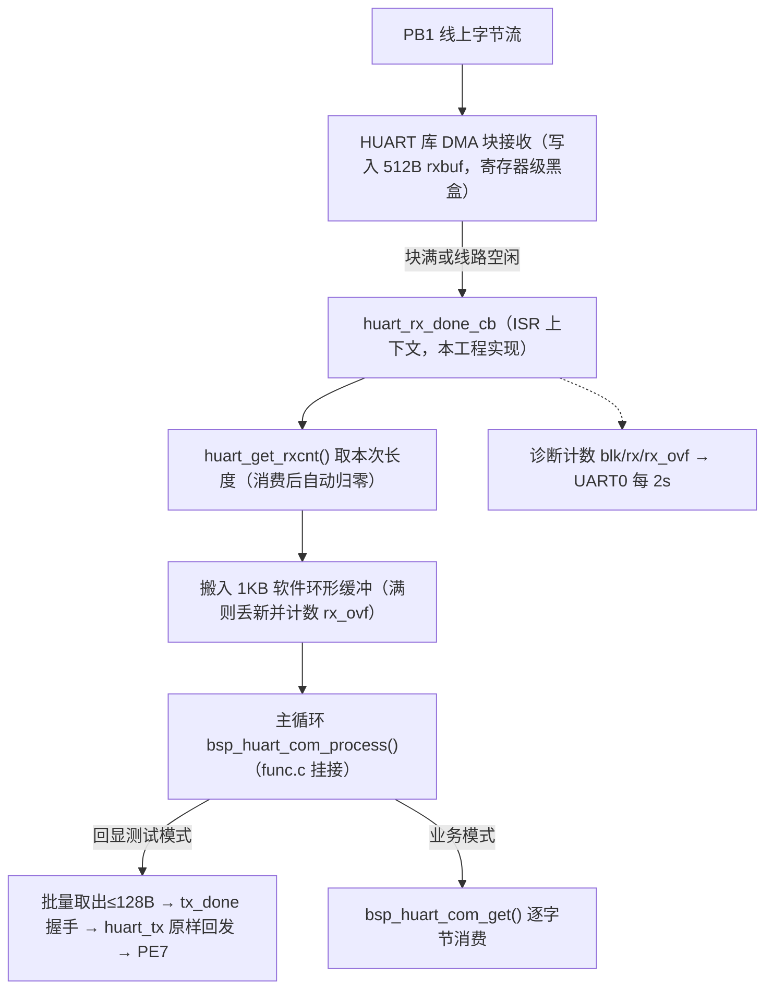
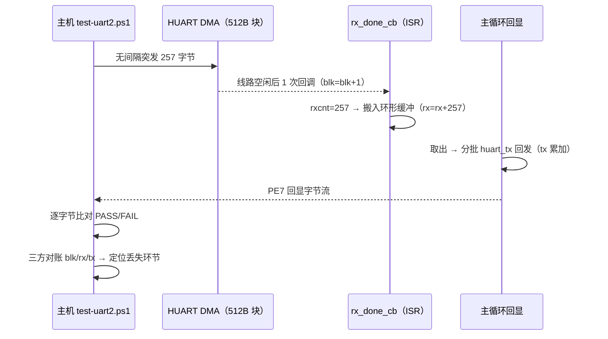
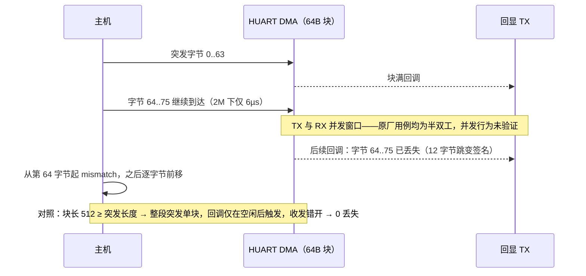

# HUART RX（高速串口接收）调通与使用指南（BT8970 无线麦 SDK）

> 本文说明 HUART 的接收路径。当前工程 HUART 测试口映射 RX=PB1、TX=PE7（与 UART2 测试口共用接线），UART0/PB3 继续作为 1.5 Mbps 调试口。发送路径见同目录 `huart_tx_bringup.md`。
>
> 证据分为：**原厂 PDF 明确**、**SDK 源码/静态库明确**、**本项目实测**和**待原厂确认**。

## 0. 编写依据

| 类别 | 出处 |
|---|---|
| 本工程驱动 | `bsp/bsp_huart_com.c`（DMA 块接收 + 回调入环形缓冲 + 回显状态机 + 诊断计数，本文实测所用固件即出自该文件） |
| 收发模型出处 | `modules/huart_audio/huart_audio_in_mix.c:71-75,115-144`（rxbuf 块 + `huart_rx_done_cb` 回调，4M 音频连续流在用）；`modules/test/vusb_test.c:21-28`（回调路径内 `huart_get_rxcnt()` 取本次长度）；`bsp/bsp_huart.c:15-48`（库到应用的回调分发入口） |
| 关键反证 | EQ 在线调试是量产功能且命令长度远小于 `EQ_BUFFER_LEN=270`——若回调只在收满缓冲后触发，EQ 永远无法工作；反证"线路空闲也会触发回调" |
| 原厂资料 | `docs/bt897x无线麦SDK.pdf` 第 48–50 页；`include/config_define.h:379` "INTF_HUART = 2 高速串口(DMA模式)" |
| 测试脚本 | `projects/microphone/tests/test-uart2.ps1`（特殊字节/间隔/无间隔突发用例与逐字节比对） |
| 实测记录 | 2026-09-10，CH340 COM17 @2M：回显全套用例 + UART0 诊断三方对账（`blk=5 / rx=1025 / tx=1025 / rx_ovf=0`，多轮重复） |

## 1. 为什么用 HUART 收：与 UART2 的本质区别

UART2 在本 SDK 中只有一个单字节接收缓冲，主循环轮询来不及取就被硬件覆盖，**无间隔连续流在所有波特率下都丢字节**（115200 下捕获率仅 ~54%，见 `uart2_rx_bringup.md` 第 6/7 节）。HUART 是库级 **DMA 块接收**：硬件自动把字节流搬进应用提供的缓冲，收满一块或线路空闲才通知一次软件，从机制上消除了逐字节轮询。

## 2. 已确认结论

### SDK 源码/静态库明确（收发模型来自原厂在树用例）

- **块接收 + 回调**：`huart_init()` 时应用提供 `rxbuf`/`rxbuf_size`，库内 DMA 把接收字节流写入该缓冲；块完成时回调应用层全局函数 `huart_rx_done_cb()`（本工程实现在 `bsp/bsp_huart_com.c`）。
- **实际长度在回调里取**：`vusb_test.c:23` 在回调路径中用 `huart_get_rxcnt()` 取本次收到的字节数——说明回调不必等满 `rxbuf_size`，**线路空闲也会触发**（否则 EQ 调试的短命令永远凑不满 270 字节缓冲、无法工作；EQ 是量产功能，反证成立）。
- **计数自动清零**：回调消费后 `rxcnt` 归零（本工程诊断行持续观察到 `rxcnt=0`）；全仓库无任何代码调用 `huart_rxfifo_clear()`，故不要主动调用它（语义未验证）。
- **回调即 ISR**：原厂 `huart_audio_in_mix.c` 在回调里做 `ring_buf_put` 后回主循环消费，本工程同构——回调里只做搬移和计数，不做耗时处理。
- **数据在回调时已在 rxbuf 中**：`vusb_test.c` 直接读结构体字段、`huart_audio_in_mix.c` 直接把 `rxbuf` 内容入 ring，均为库写完后回调的模型。
- 引脚枚举、互斥约束（EQ/QTEST 等强制 `HUART_EN`、与 `UART2_COM_EN` 共脚）见 `huart_tx_bringup.md` 第 2 节，此处不重复。

### 本工程实现（bsp/bsp_huart_com.c）



## 3. 实测结论（2026-09-10，CH340 COM17 @2 Mbps，8N2）

### 测试原理

回显闭环与 UART2 版本同构（见 `uart2_rx_bringup.md` §4「测试原理」），HUART 版的判读规则换成块粒度：

- `blk`（回调次数）应等于用例数——每种长度的突发恰好触发 1 次"线路空闲后回调"，`blk` 偏多说明块长小于突发被拆块；
- `rx` 应等于主机发送字节数、`tx` 等于回显字节数、`rx_ovf=0`——三者完整而主机仍缺字节时，丢失在适配器/链路（固件无辜）；
- `rx` 缺斤且 `rx_ovf=0` → 丢在 DMA 环节（当前配置下未发生）。



### 实测数据

固件 `HUART_COM_RX_TEST_EN=1`（二进制回显），主机 `tests/test-uart2.ps1` 逐字节比对：

| 用例 | 结果 | 对照 UART2 同用例 |
|---|---|---|
| 特殊字节 0x00/0xFF/重复/交替 | **5/5** | 相同（UART2 修复软件过滤后可通过） |
| 全字节 00..FF，10ms 间隔 | **256/256** | 相同 |
| 全字节 00..FF，1ms 间隔 | **256/256** | 相同 |
| **无间隔突发 128/129/255/256/257 字节** | **固件侧 100%** | UART2 仅 23%~55% |

固件侧证据（UART0 诊断计数）：整套突发用例 5 种长度共 1025 字节，`blk=5`（每种长度恰好 1 次回调，即**线路空闲后才触发**）、`rx=1025 tx=1025`、`rx_ovf=0`，多轮重复零丢失——HUART 把 UART2 的结构性丢流变成了固件侧零丢失。

主机侧在无间隔突发时偶发单字节丢失（每 ~5 KB 持续突发约 1 字节，随机位置单字节跳变，如 burst-129 丢第 75 字节、burst-256 丢第 76 字节）：经诊断计数器反证固件收发完整，丢失发生在 **CH340 接收回显方向**，属适配器在 2M 规格上限处的 USB 桥接抖动。有间隔（≥1ms）时主机侧亦 100%。实际业务"发命令-等回包"场景收发错开，不受影响。

## 4. 关键约束与踩坑（本项目实测）

### 4.1 DMA 块长必须 ≥ 单次突发长度

`HUART_COM_BLOCK_SIZE=64` 时无间隔突发失败，签名高度一致：**第 1 块（64 字节）全对，从第 64 字节起精确跳过 12 字节后继续正确**。机理：块满回调 → 主循环立刻回显 → **回显 TX 与后续 RX 字节并发**，而原厂全部在树用例均为半双工（`tx_port==rx_port` 同一根脚，收完才发），并发场景未经验证且实测丢字节（与波特率无关：1ms 间隔的回显交错 100% 通过，因为收发在时间上错开）。

块长不足时的丢字节时序：



修复与规则：`HUART_COM_BLOCK_SIZE=512` ≥ 测试最长突发 257 字节，整段突发落入同一 DMA 块，回调只在线路空闲后触发一次，收发自然错开。**若业务存在超过块长的连续流，须启用 `rxbuf_loop=1` 环形模式（原厂 BQB 用法）重做验证。**

**连续多块流已实测定位（2026-09-10，同 SDK 版本第三方双机回传测试复现）**：非环形块模式下 PC 背靠背连续灌 50 KB，**第 1 块正确、第 2 块起数据错位**（递增码流逐块相位分析证实；恒值码流 0x00/0xFF/0x55/0xAA 因错位不改内容而完全不可见——恒值"通过"是假象）。逐块流控后（发 270B 等线路空闲再发下一块）115200~1.5M 六档全部字节级正确、板端 `[rx]` 计数与主机一致——HUART 物理层无问题，是**库非环形模式的连续块重启缺陷**（库黑盒；COM9 可见库内部 1KB 缓冲提示 `lock [huart] repeat, addr=10021000, size=0x400`）。连续流处理路径：应用层逐块流控、`rxbuf_loop=1` 环形模式重设计，或向原厂索取库实现资料。高波特率下错位伴随字节丢失使块边界移位、末块永不完整，表现为"恰好丢 270 字节（一个块）"。

### 4.2 全双工并发未验证

即使块长覆盖了突发，"一边持续收一边发"的全双工工作方式没有任何原厂用例背书。当前工程约束为**半双工使用**：回显/应答在接收空闲后进行。需要真正全双工高速流的场景，建议要求原厂确认 HUART 引擎的并发能力。

### 4.3 资源互斥清单（使能 `HUART_COM_EN=1` 时必须检查）

| 冲突项 | 处理 |
|---|---|
| `EQ_DBG_IN_UART=1`（占用 HUART@1.5M + `eq_rx_buf`） | 置 0，测完恢复 |
| `UART2_COM_EN=1`（共用 PE7/PB1） | 置 0 |
| `QTEST_EN`/`ANC_TOOL_EN`/`BT_SCO_DUMP_TX_EN`/`CHARGE_BOX_INTF_SEL==INTF_HUART` | 保持 0/INTF_UART1，否则与 bsp_huart.c 回调符号冲突，链接报错（有意保护） |

## 5. 使用指南

### 5.1 消费接口

```c
u8 bsp_huart_com_get(u8 *ch);          // 取 1 字节，返回 0 表示空
u8 bsp_huart_com_tx_idle(void);        // 发送是否空闲
void bsp_huart_com_get_stats(huart_com_stats_t *stats);  // 计数器快照
```

主循环必须持续执行 `bsp_uart2_com_process()` 同位置的 `bsp_huart_com_process()`（已挂在 `functions/func.c` 的 `func_process()` 中）。环形缓冲 1KB，满时丢新数据并累计 `rx_overflow_count`——业务侧消费不及时可通过诊断发现。

### 5.2 构建与测试流程

```powershell
powershell -ExecutionPolicy Bypass -NoProfile -File projects/microphone/build.ps1 -Rebuild
# 烧录 Output/bin/app.dcf 后（PC TX->PB1，PC RX->PE7，共地）：
powershell -ExecutionPolicy Bypass -NoProfile -File projects/microphone/tests/test-uart2.ps1 -Port COM17 -BaudRate 2000000 -Case all
```

上电自检：UART0（COM9，1.5M）应打印 `huart com ready: TX=PE7 RX=PB1 baud=… block=… rx_test=… tx_test=…`。

## 6. 待原厂确认

- 回调确切触发条件（块满/空闲超时的阈值与时间常数）——"空闲也会触发"目前由 EQ 功能反证 + 本项目 `blk=5/rx=1025` 实测支撑，未见文档明文。
- `rxbuf_loop=1` 环形模式下回调时机与读取方式（原厂仅 9600 波特率 BQB 用例）。
- 全双工并发收发的官方支持状态。
- HUART 输入时钟与波特率公式（本项目实测 2M~24M 分频均准确）。

## 7. 相关文档

- 发送路径：`docs/peripheral/huart_tx_bringup.md`
- UART2 对照：`docs/peripheral/uart2_rx_bringup.md`（单字节缓冲+轮询的边界与结论）
- 测试脚本：`projects/microphone/tests/README.md`
- 原厂依据：`docs/bt897x无线麦SDK.pdf` 第 48–50 页
