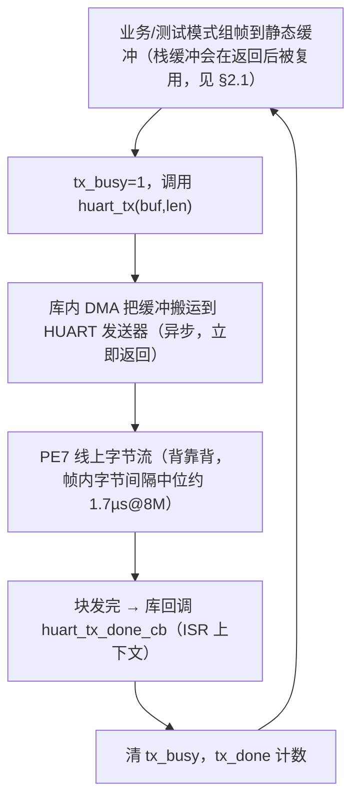
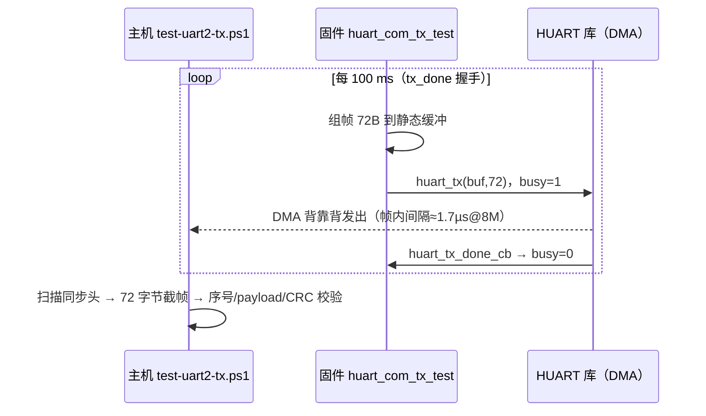
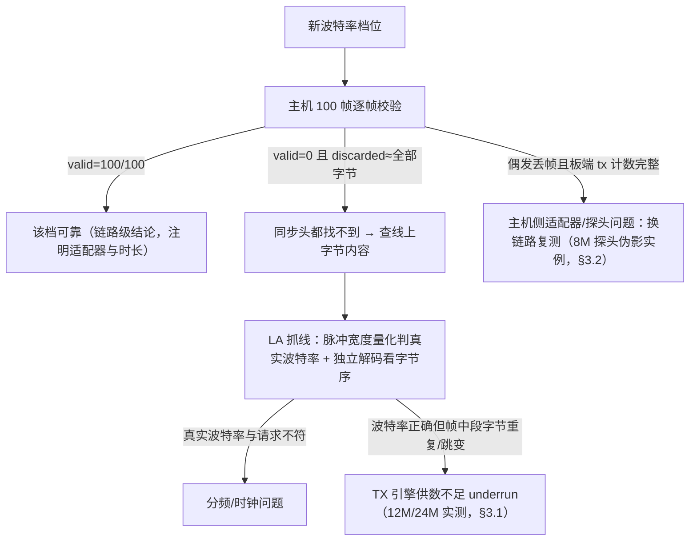

# HUART TX（高速串口发送）调通与使用指南（BT8970 无线麦 SDK）

> 本文说明 HUART 的发送路径。当前工程 HUART 测试口映射 TX=PE7、RX=PB1（与 UART2 测试口共用接线），UART0/PB3 继续作为 1.5 Mbps 调试口。接收路径见同目录 `huart_rx_bringup.md`。
>
> 证据分为：**原厂 PDF 明确**、**SDK 源码/静态库明确**、**本项目实测**和**待原厂确认**。没有量化数据的实验不表述为芯片规格。

## 0. 编写依据

| 类别 | 出处 |
|---|---|
| 本工程驱动 | `bsp/bsp_huart_com.c`（发送链路、静态帧缓冲契约、诊断计数，本文实测所用固件即出自该文件） |
| 库 API | `libs/api_uart.h`（`huart_t`/`huart_init`/`huart_tx`/`huart_get_rxcnt` 等；实现在 `libs/libdrivers.a` 内，寄存器级黑盒） |
| 原厂在树用例 | `bsp/bsp_huart.c`（EQ 调试 1.5M）；`modules/test/vusb_test.c:199-215`（独立 `huart_t` 初始化写法）；`modules/huart_audio/huart_audio_in_mix.c:115-144`（块接收+回调模型，4M）；`modules/debug/debug.c:135-138`（大块分半发送，暗示单次块长上限）；`modules/debug/audio_dump.c`（8M 档位，注释"受限于逻辑分析仪"） |
| 原厂资料 | `docs/bt897x无线麦SDK.pdf` 第 48–50 页；`include/config_define.h:379` "INTF_HUART = 2 高速串口(DMA模式)" |
| 测试脚本 | `projects/microphone/tests/`：`test-uart2-tx.ps1`（主机帧校验）、`la_validate_frames.py`（LA 解码逐帧校验）、`logic2_mcp_client.py`（LA 采集） |
| 实测记录 | 2026-09-10：CH340 COM17（2M 回显对账）；CP210x COM6（2M/3M/4M/8M/12M TX 扫描）；Saleae Logic 24 MS/s 线级采集（12M/24M/8M 波形与解码） |

## 1. 已确认结论

### 原厂 PDF 明确

- 芯片有 UART0、UART1、UART2 和 HUART；`config_define.h` 注释 HUART 为"高速串口(DMA模式)"。
- HUART 引脚映射由库内处理，应用只传引脚枚举。

### SDK 源码/静态库明确

- HUART 寄存器**不在** `include/sfr.h` 中公开，收发实现在预编译库（`libs/libdrivers.a`）内，应用只见 API（`libs/api_uart.h`）：

```c
typedef struct {
    union {
        struct {
            uint8_t  tx_port : 4;      // 发送引脚 HUART_TR_*
            uint8_t  rx_port : 4;      // 接收引脚 HUART_TR_*
            uint8_t  rxisr_en : 1;     // 接收块完成回调开关
            uint8_t  txisr_en : 1;     // 发送完成回调开关
            uint8_t  rxbuf_loop : 1;   // 接收环形模式（本工程未用，语义待确认）
            uint8_t  tx_1st : 1;       // 语义待确认
        };
        uint16_t all_setting;
    };
    uint16_t rxbuf_size;               // DMA 接收块长（字节）
    uint8_t *rxbuf;                    // DMA 接收缓冲
} huart_t;

void huart_init(huart_t *huart, uint32_t baud_rate);
void huart_tx(const void *buf, uint len);   // 异步 DMA 发送
uint huart_get_rxcnt(void);
void huart_wait_txdone(void);               // modules/debug/debug.h
```

- 引脚枚举 `HUART_TR_*`：PA7=0、PB2=1、PB3=2、**PE7=3**、PF0=4、PA6=5、**PB1=6**、PB4=7、PE6=8、PF1=9、VUSB=10（`projects/microphone/xcfg.h:22` 同义注释）。
- 库在发送完成/接收块完成时回调应用层的 **`huart_tx_done_cb()` / `huart_rx_done_cb()`**（全局符号，应用必须提供；本工程由 `bsp/bsp_huart_com.c` 提供）。
- 原厂在树用例的 TX 用法全部是"发完再收"的半双工：EQ 调试（`bsp_huart.c`，1.5M）、充电仓（`charge_box.c`）、产测（`qtest.c`/`iodm.c`）、音频 dump（`audio_dump.c`，8M）、HUART 音频（`huart_audio_*.c`，4M）、测试盒（`vusb_test.c`）。
- `modules/debug/debug.c:135-138` 把大块数据分两次 `huart_tx(len/2)` + `huart_wait_txdone()` 发送，暗示库对单次发送块长可能有上限；本工程实测单次 128 字节（回显批次）无问题。

### 本工程实现（bsp/bsp_huart_com.c）

- 静态 `huart_t`：tx_port=PE7、rx_port=PB1、`rxisr_en=1`、`txisr_en=1`、非环形块模式，`rxbuf`=512 字节 DMA 块缓冲（`ALIGNED(4)` 静态数组）。
- 发送链路：业务代码/测试模式把数据交给 `bsp_huart_com` 层，由它持 `tx_busy` 标志调 `huart_tx()`，`huart_tx_done_cb()`（ISR 上下文）清标志并计数。
- 诊断走 UART0 每 2 秒一行：`[huart] blk=… rx=… rx_ovf=… tx=… tx_done=… tx_skip=… rxcnt=…`。

发送数据通路：



## 2. 关键契约与踩坑

### 2.1 发送缓冲在 tx_done 前必须保持有效（本项目实测踩坑）

`huart_tx()` 是**异步 DMA 发送**，立即返回。**栈上数组作发送缓冲会在函数返回后被复用**，DMA 未搬完的部分被覆盖——实测现象：每帧尾部约 8 字节变成后续 printf 等调用的栈数据（帧头/序号/payload 前段正确、帧尾 CRC 区域被污染，主机 CRC 全错但序号无断档）。修复：发送帧缓冲改静态（与原厂 `vusb_test.c` 静态命令缓冲的做法一致）。

### 2.2 与其它 HUART 使用者互斥（链接期保证）

HUART 是单外设。`EQ_DBG_IN_UART`（在线 EQ 调试）、`CHARGE_BOX_INTF_SEL==INTF_HUART`、`QTEST_EN`、`ANC_TOOL_EN`、`BT_SCO_DUMP_TX_EN` 任一开启都会强制 `HUART_EN=1`（`include/config_extra.h:124-132`），使 `bsp/bsp_huart.c` 编译进固件并提供自己的 `huart_rx_done_cb`/`huart_tx_done_cb`。**此时 `HUART_COM_EN` 必须为 0**，否则回调符号重复定义，链接直接报错——这是有意留下的互斥保护。

### 2.3 与 UART2_COM 共用引脚

PE7/PB1 同时是 UART2 的映射脚。`UART2_COM_EN` 与 `HUART_COM_EN` 不能同时为 1，否则 `FUNCMCON2` 映射互相覆盖。

## 3. 波特率实测扫描（2026-09-10）

### 测试原理

帧格式与检错覆盖同 `uart2_tx_bringup.md` §7「测试原理与归因方法」（同步头定位、序号查丢帧乱序、payload 递增查字节滑移、CRC-16/MODBUS 查任意比特错）。HUART 版本的差别只在固件发送方式：帧进**静态缓冲**后由 `huart_tx()` 一次 DMA 发出，帧内字节背靠背，帧间由 `tx_done` 握手节流：



每个波特率档位的判定流程（归因决策树总纲见 `uart2_tx_bringup.md` §7，此处不重复）：



### 实测数据

固件：`HUART_COM_TX_TEST_EN=1`，每 100 ms 发一帧 72 字节（55 AA 5A A5 + u16 LE 序号 + 64 字节 payload=(seq+i)&0xFF + CRC-16/MODBUS LE）。主机 `tests/test-uart2-tx.ps1` 逐帧校验（CP210x COM6，8N2）：

| 波特率 | 结果 | 备注 |
|---|---|---|
| 2 Mbps | **100/100**，elapsed 10035 ms | CH340/CP210x 双适配器均过 |
| 3 Mbps | **100/100**，elapsed 9997 ms | |
| 4 Mbps | **100/100**，elapsed 10050 ms | 原厂音频流档位 |
| 8 Mbps | **100/100** ×4 轮（累计 400 帧），序号 60545→60889 连续 | 原厂 dump 档位，**实测可靠上限** |
| 12 Mbps | **valid=0/100** | 见 3.1 |
| 24 Mbps | 未做主机校验（无适配器支持），线级波特率准确 | 见 3.1 |

帧周期全程 99.97~100.05 ms；帧内字节间隔中位 1.708 µs（背靠背 DMA 发送，与 UART2 轮询驱动的 31.75 µs 相比是线速连续流）。

### 3.1 12M/24M 失效机理：TX 供数不足（underrun），波特率本身正确

逻辑分析仪（Saleae Logic，24 MS/s）抓 PE7 线级波形：

- **波特率分频准确**：12M 配置下脉冲宽度按 83 ns（2 采样）整数倍量化；24M 配置下出现大量 41.7 ns（1 采样）脉冲。
- **字节内容损坏**：12M 下帧中段出现"字节重复+跳变"，如期望 `...AE AF B0 B1 B2...` 实测 `...AE AF | F8 F9 FB | B3 B4...`（0xB0~B2 被杂字节顶替后正确续传）；0.5 s 内仅 1 个干净同步头；主机侧 20 秒收到全部字节却无一帧 CRC 通过。
- **定性**：字节重复是发送器在 DMA 未及时补数时重发当前字节的典型 underrun 签名。12M 下字节时间仅 833 ns，引擎/DMA 供数达到极限；原厂在树代码最高使用 8M（`audio_dump.c` 的 8M 还注明"受限于逻辑分析仪"），从未使用 12M 以上。

结论：**HUART TX 实用上限 8 Mbps（库级）**。12M 以上波特率可被准确分频输出，但数据完整性无保证。

### 3.2 逻辑分析仪探头伪影告警（避免误判）

LA 探头夹上 PE7 后曾观测到 8M 码流约 23% 帧中段损坏（成簇出现），而拆下探头换回 CP210x 后同固件 3 轮 300/300 全对。结论：**探头电容 + USB 地环路会使 8M 边沿在 Logic 采样阈值上变临界，产生观测伪影**。用 LA 判定 ≥8M 信号质量时，主机侧（或另一路独立接收）交叉验证不可省；12M 的损坏结论因主机与 LA 双重一致而不受此影响。

## 4. 使用指南

### 4.1 配置（projects/microphone/config.h）

```c
#define HUART_COM_EN                    1       //使能HUART测试口，与UART2_COM_EN互斥
#define HUART_COM_BAUD                  8000000 //实测可靠上限8M；12M起TX引擎underrun
#define HUART_COM_TX_TEST_EN            1       //TX板测模式：100ms周期发送带序号+CRC16帧
#define HUART_COM_RX_TEST_EN            0       //RX板测模式见 huart_rx_bringup.md
#define HUART_COM_BLOCK_SIZE            512     //DMA接收块长，需>=单次突发长度
```

同时必须：`EQ_DBG_IN_UART 0`（测完恢复）、`UART2_COM_EN 0`。

### 4.2 业务侧发送

参照 `uart2_com_tx_test_process()`：数据放入**静态缓冲** → `tx_busy` 置位 → `huart_tx(buf, len)` → 等待 `bsp_huart_com_tx_idle()`（由 `huart_tx_done_cb` 清Busy）再发下一批。禁止在 tx_done 前修改/释放缓冲。

### 4.3 构建与测试流程

```powershell
powershell -ExecutionPolicy Bypass -NoProfile -File projects/microphone/build.ps1 -Rebuild
# 烧录 Output/bin/app.dcf 后：
powershell -ExecutionPolicy Bypass -NoProfile -File projects/microphone/tests/test-uart2-tx.ps1 -Port COM6 -BaudRate 8000000 -FrameCount 100
```

接线：开发板 TX(PE7) → USB-UART RX，共地。帧格式与 UART2 TX 完全一致，主机脚本零改动复用。

## 5. 待原厂确认

- HUART 输入时钟频率与波特率分频公式（库黑盒；实测 2M~24M 分频均准确）。
- `huart_tx()` 单次块长上限（`debug.c` 分半发送暗示存在；实测 128 字节单次可发）。
- TX FIFO 深度与 DMA 供数带宽——12M 起 underrun 的确切边界（8M 实测可靠、12M 实测损坏，6M 未测）。
- `tx_1st` 位语义。
- 芯片规格书对 HUART 最高波特率的表述。

## 6. 相关文档

- 接收路径：`docs/peripheral/huart_rx_bringup.md`
- UART2 对照：`docs/peripheral/uart2_tx_bringup.md`（轮询式发送，有效吞吐 ~28.6 KB/s@3M，见其第 5 节）
- 测试脚本：`projects/microphone/tests/README.md`
- 原厂依据：`docs/bt897x无线麦SDK.pdf` 第 48–50 页
