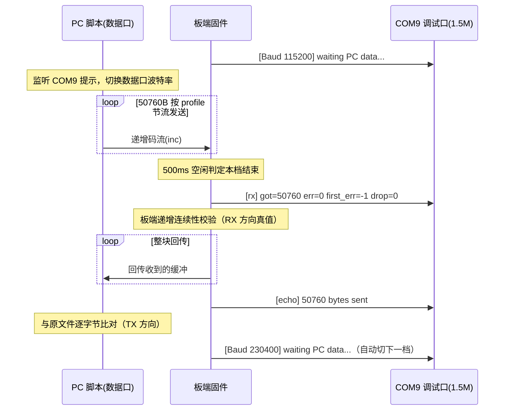

# 普通/高速串口最大波特率统一测试计划（单板 + CP210x/CH340）

> 目标：用同一套方法、同一份码流、同一条判定标准，测出**普通串口（UART2）**和**高速串口（HUART）**
> 各自 **RX（PC→板）** 与 **TX（板→PC）** 两个方向的最大无错波特率，共四个测试项。
> 每档结果都能区分"板子的能力"和"适配器的限制"，汇报时数据可追溯到证据。
>
> 配套固件：`modules/test/serial_max_baud_test.c`；配套脚本：`tests/serial_max_baud_test.py`。

# 1 目的与背景

## 1.1 要回答的问题

"普通串口和高速串口最大能跑多少波特率"需要分四项回答，且每项要区分三层：

| 层次 | 含义 | 数据来源 |
| --- | --- | --- |
| 能配多高 | 寄存器分频允许配置的上限 | 驱动分频公式（UART2: 24M/baud-1；HUART: 库内分频） |
| 规格内实测最大无错 | 适配器规格范围内，零误码零丢失的最高档 | 本次统一测试结果表 |
| 线级/结构上限 | 信号物理层上限与软件结构吞吐上限 | LA 线级验证 + 驱动结构分析 |

## 1.2 为什么要重测（历史方法不统一）

历史测试分散在四份文档，方法各异，数字不能直接横向对比：

| 历史/文档 | 方法 | 局限 |
| --- | --- | --- |
| `uart2_tx_bringup.md` | 72B CRC 帧 @100ms 周期 ×100 | 稀疏帧，验证不了持续吞吐 |
| `uart2_rx_bringup.md` | 小包回显 + 无间隔突发 | 突发场景结构性必败，非"最大波特率"问题 |
| `huart_tx_bringup.md` / `uart2_huart_compare.md` | 72B 帧单向 | 同上 |
| `huart_dual_failure_analysis.md` | HUART 50KB 回传 | 只有 HUART，UART2 无对应数据 |

本次用 **HUART 已验证的 50KB 回传法**统一推广到四个测试项。

# 2 统一测试方法

## 2.1 每档波特率的三段式流程（四个测试项完全一致）



- **RX 方向判定**（板端真值，与适配器接收质量无关）：`got==50760 且 err==0 且 drop==0`
- **TX 方向判定**（回传比对）：PC 收到的字节与板端收到的缓冲完全一致
- 全部档位自动爬梯，PC 脚本靠 COM9 提示同步，**全程无需人工换档**

## 2.2 测试数据

`tests/huart_dual_inc.bin`，50760 字节，内容 `data[i] = i & 0xFF` 循环递增。

**必须用递增码流**：恒值码流（00/FF/55/AA）会掩盖 HUART 库非环形模式的块错位缺陷
（`huart_dual_failure_analysis.md` §1.4 已用递增相位分析证明），递增码流让任何错位/丢字节都表现为误码。

## 2.3 节流 profile（写死在脚本中，按外设结构固定）

| profile | 块大小 | 块间隔 | 设计依据 |
| --- | --- | --- | --- |
| `huart` | 512 B | 10 ms | 块长=固件 DMA 块长；逐块节流规避库非环形模式"连续块重启"缺陷（§1.5 实验矩阵 #2/#4/#5 组合） |
| `uart2` | 64 B | 8 ms | 64B < 驱动 128B RX 环形缓冲，块内不溢出；8ms > 64B 轮询排水时间（64×31.75µs≈2ms），块间排空 |

> 节流参数属于测试方法的一部分（模拟真实应用中的分包协议），不是掩盖问题：
> 无间隔持续流的结果已有定论——UART2 结构性跟不上（`uart2_rx_bringup.md`）、
> HUART 库缺陷（`huart_dual_failure_analysis.md`），文档引用见 §7。

## 2.4 失败归因规则（汇报用核心逻辑）

| 现象 | LA 线级证据 | 结论 |
| --- | --- | --- |
| 板端 `[rx]` FAIL | RX 线（PB1）解码干净 | **板 RX 能力不足**（真结论） |
| 板端 `[rx]` FAIL | RX 线波形差/无法解码 | **适配器 TX 超规格限制**（板能力未证伪） |
| 板端 `[rx]` PASS 但回传 DIFF | TX 线（PE7）解码正确 | **适配器 RX 超规格限制**（板 TX 能力已证） |
| 板端 `[rx]` PASS 但回传 DIFF | TX 线解码错误 | **板 TX 能力不足**（真结论） |

## 2.5 两层结论的说明（信号完整性 ≠ 有效吞吐）

- **信号完整性**：该波特率下波形/误码是否正确 —— 本测试测的是这个。
- **有效吞吐**：单位时间实际能传多少数据。UART2 TX 受驱动结构限制（128B 软件队列、
  主循环逐字节提交）封顶 ~28.6KB/s，与波特率无关（`uart2_huart_compare.md` §2）；
  UART2 RX 需按 profile 节流。汇报时两层分开说，避免"能配 3M 所以吞吐 300KB/s"的误解。

# 3 环境与接线（只接一次）

## 3.1 硬件清单

| 物品 | 用途 | 备注 |
| --- | --- | --- |
| BT897x 开发板 | 被测板 | 烧两份测试固件 |
| CH340 适配器 | 数据口主力 | 官方规格上限 **2M** |
| CP210x 适配器 | 交叉验证 + 超规格探索 | 规格通常 1M（视型号），历史连续流 ≥1.5M 不稳 |
| USB 转串口 ×1 | COM9 调试口常驻 | 板上 UART0/PB3，1.5M 固定 |
| Saleae 逻辑分析仪（可选） | 线级归因 | 24MS/s，能力边界见项 3 |

## 3.2 引脚与接线

**UART2 与 HUART 共用引脚**，所以四个测试项接线完全相同，换测项只换固件不动线：

| 信号 | 板端引脚 | 接适配器 |
| --- | --- | --- |
| 板 TX | **PE7** | → 适配器 RXD |
| 板 RX | **PB1** | ← 适配器 TXD |
| GND | GND | ← 适配器 GND（必须共地） |

调试口 COM9（PB3，1.5M）全程保持连接，脚本靠它同步。

> 电平均为 3.3V。COM 口号以设备管理器为准（历史登记：COM9=调试 / COM17=CH340 /
> COM6、COM19=CP210x）；可用 `python serial_max_baud_test.py --data-com list` 枚举。

# 4 固件构建态（config.h 改动不入库）

测试模块由两个宏控制（`config.h`）：

| 宏 | UART2 构建态 | HUART 构建态 |
| --- | --- | --- |
| `SERIAL_MAX_BAUD_TEST_EN` | 1 | 1 |
| `SERIAL_MAX_BAUD_TEST_USE_UART2` | **1** | **0** |
| `UART2_COM_EN` | 1 | 0 |
| `EQ_DBG_IN_UART` | 0 | 0 |
| `HUART_BAUD_TEST_EN` / `HUART_COM_EN` | 0 | 0 |

- 波特率阶梯写在固件里：UART2 = 115200~3M 共 8 档；HUART = 115200~9.5M 共 13 档
  （9.5M 与回环 PHY 证据对齐，回环 10M 起误码，见 §7）。
- 预编译产物（`Output/bin/`，不入库）：
  - **`app_uart2_test.dcf`** —— 项 1 用
  - **`app_huart_test.dcf`** —— 项 2 用
- 需要重编：改好 config.h 后在 `projects/microphone` 下执行
  `powershell -ExecutionPolicy Bypass -File build.ps1 -Rebuild`。

# 5 测试项（逐项执行）

## 项 0：环境确认（约 5 分钟）

1. 接线按 §3.2，确认共地。
2. 设备管理器确认三个 COM 口：调试口（COM9）、CH340、CP210x。
3. 烧录 `app_uart2_test.dcf`，复位后 COM9 终端（1.5M）应打印：
   ```
   === Serial Max Baud Test (UART2) Start ===
   [Baud 115200] waiting PC data...
   ```
   看到提示即环境 OK。（注意：板子停在此处等数据，不会自动推进）

## 项 1：UART2-RX + UART2-TX（烧 `app_uart2_test.dcf`，一次跑完两个方向）

1. 接线：CH340 按 §3.2 接 PE7/PB1/GND。
2. 启动脚本（**先启脚本，再按板子复位**，保证脚本不错过首条提示）：
   ```bash
   cd projects/microphone/tests
   python serial_max_baud_test.py --debug-com COM9 --data-com COM17 --periph uart2 --adapter ch340
   ```
3. 脚本自动跑完 8 档（115200→3M），每档打印一行结果并追加到
   `tests/serial_max_baud_results.md`。单档约 15~25s（UART2 节流吞吐 ~8KB/s），
   全程约 3~4 分钟。
4. **预期输出样例**：
   ```
   | 115200 | ch340 | 50760 | 0 | 0 | OK | PASS | PASS |
   | 921600 | ch340 | 50760 | 0 | 0 | OK | PASS | PASS |
   | 3000000 | ch340 | 50760 | 0 | 0 | DIFF (首差异@xxx) | PASS | FAIL |
   ```
5. **交叉验证（CP210x）**：换 CP210x 接数据口重跑一遍，
   `--data-com COM19 --adapter cp210x`。两次结果对照：
   - 3M 档 CH340 属超规格（规格 2M），若 CP210x 通过而 CH340 失败，归因适配器；
   - 中间档两边都 PASS 才算数。
6. 填结果表（模板见项 4）。

**结果表模板（UART2）**：

| 波特率 | CH340 RX | CH340 TX | CP210x RX | CP210x TX | 归因/备注 |
| --- | --- | --- | --- | --- | --- |
| 115200 | | | | | |
| 230400 | | | | | |
| 460800 | | | | | |
| 921600 | | | | | |
| 1M | | | | | |
| 1.5M | | | | | |
| 2M | | | | | |
| 3M | | | | | CH340 超规格档 |

## 项 2：HUART-RX + HUART-TX（烧 `app_huart_test.dcf`，接线不变）

1. 重新烧录 `app_huart_test.dcf`，**接线不动**（两外设共用 PE7/PB1）。
2. 先跑 CH340 主力：
   ```bash
   python serial_max_baud_test.py --debug-com COM9 --data-com COM17 --periph huart --adapter ch340
   ```
3. 再跑 CP210x 交叉：
   ```bash
   python serial_max_baud_test.py --debug-com COM9 --data-com COM19 --periph huart --adapter cp210x
   ```
4. 13 档（115200→9.5M）自动跑完，全程约 5~8 分钟（>2M 档发送快，回传同速）。
5. **历史对照预期**（用于 sanity check，不是预设结论）：
   - ≤1.5M：历史上六档全 PASS，本次应同样 PASS；
   - 2M/3M：历史上板端 `got=50760`（板收对了），丢数发生在 CH340 回传方向——
     本次若板端 `[rx]` PASS 而回传 DIFF，与历史一致，归因适配器 RX（§2.4）；
   - >3M：适配器 TX 超规格，板端 FAIL 时按 §2.4 用 LA 归因，不能直接判板子不行。
6. 填结果表（模板同项 1，行换成 13 档）。

## 项 3：LA 线级验证（按需，用于 §2.4 归因）

**何时需要**：① 适配器超规格档（UART2 3M、HUART >2M）出现 FAIL 需归因；
② 高波特率 TX 无规格内适配器可验证时，用 LA 解码做线级验收。

**接线**：探头勾被观测线——归因 RX 项勾 **PB1**（看适配器发出的波形），
归因 TX 项勾 **PE7**（看板子发出的波形），地线就近。

**设备能力边界（Saleae Logic，24MS/s，如实标注）**：

| 波特率 | 样点/位 | 能力 |
| --- | --- | --- |
| ≤3M | ≥8 | Async Serial 解码 + 字节级校验（历史已验证到 3M） |
| 6M | 4 | 解码可信 |
| 8M | 3 | 解码可信（历史上限；≥8M 有探头电容伪影，须与主机侧交叉验证） |
| 12M | 2 | 只能脉宽量化（验分频准确，不校验内容） |
| ≥24M | ≤1 | 不可解码，不可判 |

**操作要点**（详见 `tests/README.md` 的 Logic 2 MCP 小节）：

1. 单档复测配合抓波：`python serial_max_baud_test.py ... --bauds 8000000`（只测该档），
   LA 先启采集（采样率 24MS/s、时长 ≥8s）再触发脚本。
2. 解码校验：导出 Async Serial CSV 后用 `python la_validate_frames.py <csv>`；
   或直接 MCP `list`/`call` 调用（`logic2_mcp_client.py`）。
3. 采集 >7s@24MS/s 会 USB ReadTimeout，长码流分两次抓或降低时长。
4. 波特率精度核验：测脉宽换算实际波特率，与标称偏差 >2% 即分频异常。

## 项 4：结果汇总与回填

1. 四个测试项各填一张表（模板见项 1/项 2），判定取两个适配器中较好的结果，
   归因列必须写清 FAIL 的责任方。
2. 汇总成四象限结论表（替换 FAQ Q10 的旧数字）：

| 测试项 | 能配多高 | 规格内实测最大无错 | LA 线级上限 | 有效吞吐/备注 |
| --- | --- | --- | --- | --- |
| UART2 RX（PC→板） | 24M（分频） | *本次填写* | *如测* | 需按 64B+8ms 节流；无间隔流结构性不可靠 |
| UART2 TX（板→PC） | 24M（分频） | *本次填写* | *如测* | 吞吐封顶 ~28.6KB/s，与波特率无关 |
| HUART RX（PC→板） | ≥9.5M（回环佐证） | *本次填写* | *如测* | 需 512B+10ms 节流 |
| HUART TX（板→PC） | ≥9.5M（回环佐证） | *本次填写* | *如测* | 历史帧测 8M PASS、12M underrun |
3. 回填动作：
   - `huart_dual_failure_analysis.md` FAQ Q10：三层答案换成本次实测数字；
   - `tests/README.md`：补 `serial_max_baud_test.py` 用法与结论索引；
   - 本文件 §5 各结果表补全。
4. **恢复生产 config.h**：`EQ_DBG_IN_UART=1`、`SERIAL_MAX_BAUD_TEST_EN=0`、
   `UART2_COM_EN=1`，重编验证后烧回生产固件 `Output/bin/app.dcf`（原生产副本注意留存）。

# 6 边界与已知限制（汇报时如实说明）

| 项 | 限制 | 证据/依据 |
| --- | --- | --- |
| CH340 | 官方规格上限 2M；3M 连续流实测丢 2~5% | `uart2_tx_bringup.md` §7 |
| CP210x | 规格通常 1M（视型号）；连续流 ≥1.5M 历史不稳 | 前期 HUART 双机测试 |
| HUART 库 | 非环形块模式，连续背靠背多块接收必现块错位；须逐块节流 | `huart_dual_failure_analysis.md` §1.5 六组合矩阵 |
| HUART PHY | 回环 9.5M PASS、10M 起误码，故本次阶梯封顶 9.5M | 同事回环报告（§7） |
| UART2 RX | 单字节接收、主循环轮询，无间隔突发捕获率 10~57% | `uart2_rx_bringup.md` §4 |
| UART2 TX | 128B 队列逐字节提交，吞吐 ~28.6KB/s 封顶 | `uart2_huart_compare.md` §2 |
| 互斥 | 一次只能烧一个外设的测试固件；`EQ_DBG_IN_UART` 须为 0 | config.h 注释 |
| 适配器 FAIL 归因 | 超规格档 FAIL 一律归因适配器，不判板子能力 | §2.4 归因规则 |

# 7 历史结论对照（本次重测的参照系）

| 通道 | 历史结论 | 出处 |
| --- | --- | --- |
| HUART 回环（无适配器） | 1.5M~9.5M 全 PASS，10M 起误码 | 同事《10-串口波特率压力测试》 |
| HUART 双机回传 | 115200~1.5M 六档 PASS；2M/3M 板端收对（50760），丢数在 CH340 回传方向 | `huart_dual_failure_analysis.md` Q10 |
| HUART TX 帧测 | 2M/3M/4M/8M 各 100 帧全过；12M FAIL（underrun） | `uart2_huart_compare.md` §3.2 |
| UART2 TX 帧测 | 115200/2M（CH340）过；3M CH340 FAIL；3M/8M/12M/24M CP210x 帧全对 | `uart2_tx_bringup.md` §7 |
| UART2 RX 回显 | ≥1ms 字节间隔时 115200/2M 全对；3M 起带间隔也丢；无间隔突发全败 | `uart2_rx_bringup.md` §4 |
| UART2 LA 线级 | 3M 逐位验证 151 帧全对（16MS/s） | `uart2_tx_bringup.md` §8 |

> 本次重测的意义：把上述不同方法得到的结论，放到**同一方法**下重新量化，
> 产出可以直接横向对比、可直接汇报的四象限数字表。
