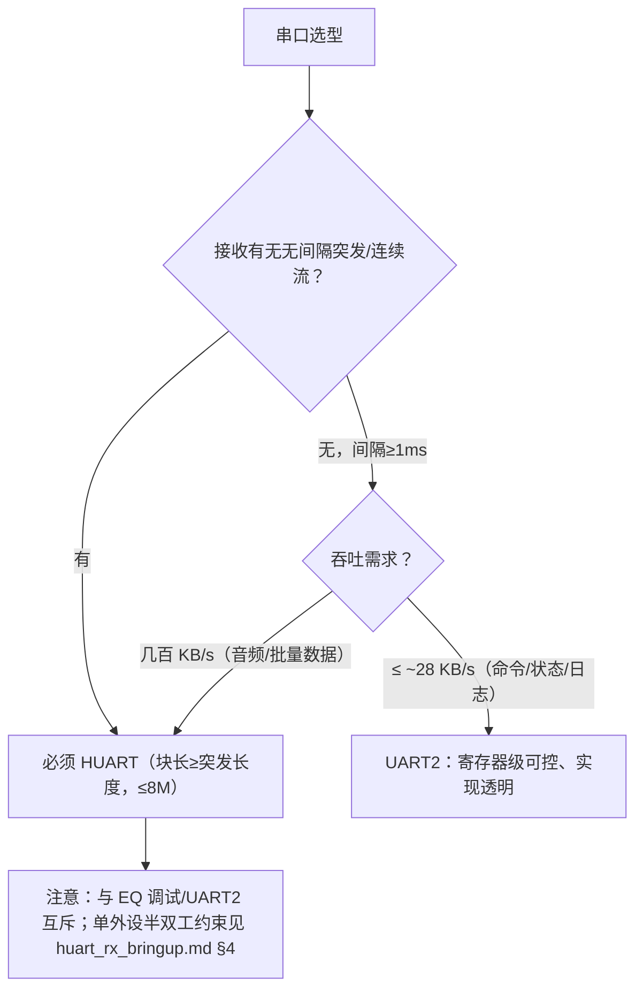

# 普通串口（UART2）与高速串口（HUART）实测对比（BT8970 无线麦 SDK）

> 一句话结论：**UART2 是"波特率能配得很高、吞吐上不去"的通道（实际 ~28.6 KB/s，与波特率无关）；HUART 是"吞吐真正能跑满线速"的通道（8M 波特率 ≈ 800 KB/s，实测可靠上限 8M）**。需要高吞吐或无间隔突发接收，选 HUART；低速命令/状态交互，UART2 更可控。

> 证据分为：**理论推导**、**本项目实测**、**待原厂确认**。本文所有实测数字出自同仓库四份专项文档，见 §7 编写依据。

## 0. 编写依据

| 类别 | 出处 |
|---|---|
| 驱动 | `bsp/bsp_uart2_com.c`（寄存器级轮询）、`bsp/bsp_huart_com.c`（原厂库 DMA+回调封装） |
| 库 API | `libs/api_uart.h`；HUART 实现在 `libs/libdrivers.a`（黑盒） |
| 专项文档 | `uart2_tx_bringup.md`（TX 六档扫描+LA 验证）、`uart2_rx_bringup.md`（RX 边界与丢字节机理）、`huart_tx_bringup.md`（TX 扫描+underrun 定位）、`huart_rx_bringup.md`（突发接收） |
| 测试脚本 | `projects/microphone/tests/`：`test-uart2-tx.ps1`、`test-uart2.ps1`、`la_validate_frames.py`、`logic2_mcp_client.py` |
| 实测环境 | 2026-09-08 ~ 2026-09-10；CH340 COM17（规格 2M）、CP210x COM6；Saleae Logic 16/24 MS/s；固件为本仓库各测试 commit 构建 |

## 1. 两个通道的定位

| | UART2（普通串口） | HUART（高速串口） |
|---|---|---|
| 实现方式 | 本工程自研寄存器级驱动，主循环轮询，**可见可改** | 原厂库（`libdrivers.a`）DMA 块传输 + 回调，**寄存器级黑盒** |
| 引脚（本工程） | TX=PE7、RX=PB1 | 同左（`HUART_TR_PE7`/`HUART_TR_PB1`），两者互斥使用 |
| 原厂在树用法 | 参考 UART1 逐字节收发 | EQ 调试 1.5M、音频流 4M、dump 6M/8M——**原厂代码最高 8M** |
| 单字节数据通路 | CPU 写 `UART2DATA` → 单字节缓冲 → 移位（无 FIFO） | 库 DMA 搬运 → 库内缓冲（深度未知）→ 移位 |

## 2. 理论 vs 实测总表（汇报核心页）

理论线速按每字节 10 bit（1 起始 + 8 数据 + 1 停止）估算：**线速(字节/秒) = 波特率 ÷ 10**。

| 指标 | UART2 理论 | UART2 实测 | HUART 理论 | HUART 实测 |
|---|---|---|---|---|
| 物理层最高波特率 | 24M（div=0，24MHz XOSC） | **24M 波形通过**（LA 逐位验证至 3M；24M 稀疏流量通过） | ≥24M（LA 证明 12M/24M 分频准确） | **数据完整上限 8M**；12M 起 underrun |
| **TX 有效吞吐** | 线速（如 24M→2.4 MB/s） | **≈28.6 KB/s**，与波特率基本无关（主循环每圈只发 1 字节） | 线速 | **≈线速至 8M**：2M→200 KB/s、8M→800 KB/s，帧内字节背靠背 |
| 线速利用率 | 高波特率下 **~1.2%**（28.6KB/2.4MB） | — | 8M 档接近 100%（帧内口径） | — |
| **RX 可靠输入** | 无 FIFO，主循环轮询 | **字节间隔 ≥1ms** 才可靠（≈1 KB/s 稳态）；无间隔突发捕获率仅 **10%~57%** | DMA 块接收 | **无间隔突发固件侧 100% 捕获**（块长 ≥ 突发长度约束） |
| 已验证档位 | 115200、2M（CH340）；3M、8M、12M、24M（CP210x，超规格） | 每档 100 帧/10s 字节级零误码；3M 另有 LA 151 帧逐位验证 | 8M 以内 | 2M/3M/4M/8M 各 100 帧 + 8M 追加 300 帧，全零误码 |

## 3. TX：理论发多少，实际发多少

### 3.1 UART2：理论 2.4 MB/s，实际 28.6 KB/s（利用率 ~1.2%）

**理论**：波特率寄存器 div=0 时线速 24 Mbps，按 10 bit/字节折算 2.4 MB/s。

**实际的瓶颈不在波特率，在喂字节的软件**：驱动每圈主循环只提交 1 字节并等发送完成。LA 实测（3M，151 帧）帧内字节间隔中位 **31.75 µs**——这就是主循环一圈的耗时，与波特率无关。由此：

```text
有效吞吐 ≈ min(线速, 1 字节 / 31.75µs) = min(线速, ~31.5 KB/s)
整帧口径（72 字节占线约 2.5ms）实测 ≈ 28.6 KB/s
```

- 115200（线速 11.52 KB/s）：字节时间 87µs > 主循环周期，**能跑满线速**；
- ≥ 约 315 kbps 后：吞吐被钳在 ~28.6~31.5 KB/s，波特率再高也无效；
- 24M 档：理论 2.4 MB/s，实测仍 ~28.6 KB/s，**线速利用率 ~1.2%**。

**实测依据**：`uart2_tx_bringup.md` §7——六档波特率 100 帧字节级零误码；LA 独立验证 101/101 + 50/50 帧 CRC 全对、序号零断档。

### 3.2 HUART：理论=线速，实测 8M 以内真跑到线速，12M 以上供数断裂

**理论**：DMA 把缓冲背靠背搬进发送器，吞吐 = 线速，仅受波特率限制。

**实测**（每档 100 帧 × 72B，CP210x 主机逐帧 CRC 校验）：

| 波特率 | 理论吞吐 | 实测结果 |
|---|---|---|
| 2M | 200 KB/s | ✅ 100/100 |
| 3M | 300 KB/s | ✅ 100/100 |
| 4M | 400 KB/s | ✅ 100/100 |
| 8M | 800 KB/s | ✅ **100/100 ×4 轮（400 帧）**，帧内字节间隔中位 1.708 µs ≈ 线速 |
| 12M | 1.2 MB/s | ❌ **valid=0/100**：LA 证明波特率分频准确（83 ns 比特），但帧中段字节重复/跳变——**TX 引擎供数不足（underrun）** |
| 24M | 2.4 MB/s | 波特率分频仍准确（41.7 ns 脉冲），未做数据校验（12M 已损坏，同机理必然不保） |

**机理**：12M 下字节时间仅 833 ns，库的 DMA/FIFO 补数跟不上，发送器 starving 时重发当前字节。这是**原厂库数据供给链路的带宽上限**（黑盒不可修），不是波特率配置被拒绝——配置被接受、分频也准确，只是数据完整性无保证。原厂在树代码最高用 8M，与实测吻合。

## 4. RX：可靠接收能力对比（差距最大的一项）

| 场景 | UART2 实测 | HUART 实测 |
|---|---|---|
| 字节间隔 ≥1 ms | ✅ 115200/2M 全部字节级正确（2M 下 256/256） | ✅ 1ms/10ms 间隔 256/256 |
| **无间隔突发 128~257 字节** | ❌ 捕获率仅 **10%~57%**（115200 约 54%、2M 约 23%、3M 约 10%~18%），轮询和实验性 IRQ14 中断都救不回——字节在软件读取前被单字节接收缓冲覆盖 | ✅ **固件侧 100% 捕获**（诊断计数 `blk=5/rx=1025/tx=1025/rx_ovf=0`，多轮零丢失） |
| 可靠边界成因 | 单字节接收缓冲 + 主循环逐字节轮询（结构性，无 FIFO 资料不可修） | DMA 块接收，块长 ≥ 突发长度即无损（本工程配 512B） |

**这是 HUART 不可替代的核心价值**：同一组突发用例，UART2 丢一半以上，HUART 一个不丢。

测试说明：HUART 主机侧在无间隔突发时偶发 1 字节 CH340 接收抖动（每 ~5 KB 约 1 字节，适配器在 2M 规格上限处），有间隔场景主机侧 100%；实际"发命令-等回包"业务收发错开，不受影响。

## 5. 为什么天花板卡在不同位置

```text
UART2：波特率(软件可配) ★★★★☆  吞吐(主循环轮询) ★☆☆☆☆  —— 卡在我们自己软件，可见可改
HUART：波特率(库分频)   ★★★★☆  吞吐(库 DMA 供数) ★★★☆☆  —— ≤8M 真满线速，12M+ 库供数断裂，黑盒不可修
```

- UART2 的 24M"能发"是指**物理层波形正确**，但测试流量平均只有 720 B/s（100ms 一帧 72B），适配器收的是稀疏字节——它从未被要求跑出 24Mbps 的数据量，实际上轮询结构也跑不出来。
- HUART 的 12M"发坏"是**真正的满线速压力测试**暴露的库级供数极限，主机与 LA 双重证据定位，非波特率配置错误。

## 6. 选型建议



## 7. 编写依据（专项文档索引）与边界

- `uart2_tx_bringup.md`：UART2 TX 六档扫描、LA 独立验证、31.75µs 字节间隔证据
- `uart2_rx_bringup.md`：UART2 RX 可靠边界、突发捕获率、IRQ14 实验
- `huart_tx_bringup.md`：HUART TX 扫描、12M underrun 线级定位、探头伪影案例
- `huart_rx_bringup.md`：HUART 突发接收、块长约束、计数器对账方法

**边界（汇报时如实说明）**：每档波特率验证为 100 帧/约 10 秒（8M 追加至 400 帧），结论是"该档链路字节级正确"，不等于长时间误码率指标；CP210x 在 8M 以上为超规格运行（UART2 12M/24M 档），已用逻辑分析仪波形独立佐证；HUART 12M 以上、全双工并发、rxbuf_loop 环形模式为待原厂确认项。
