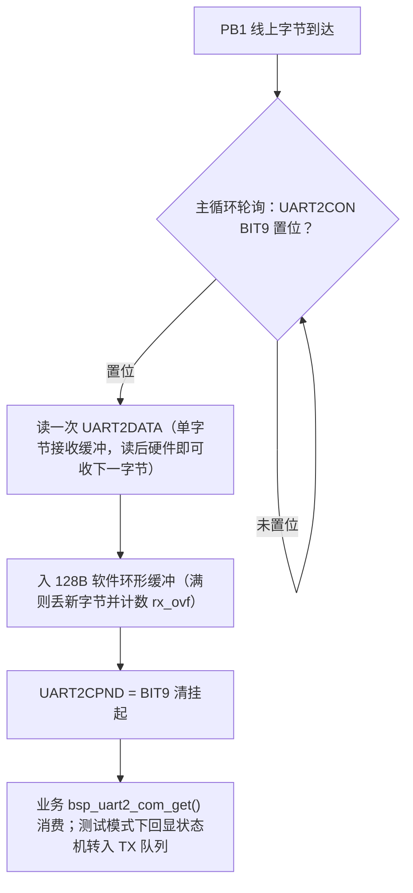
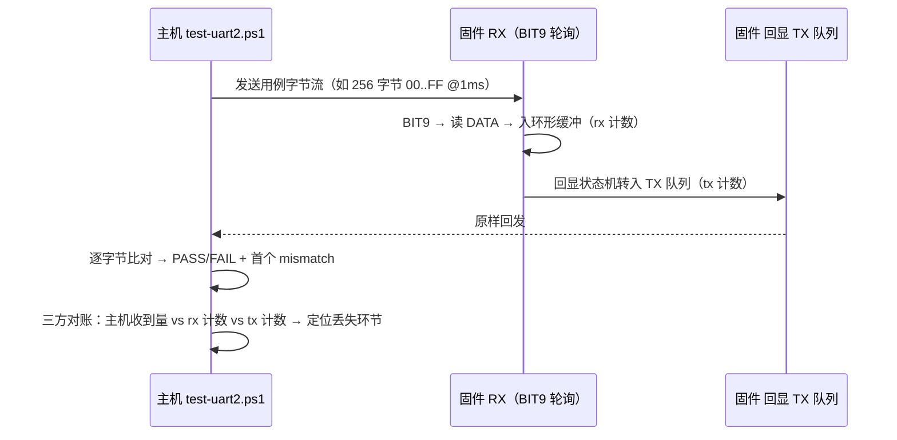
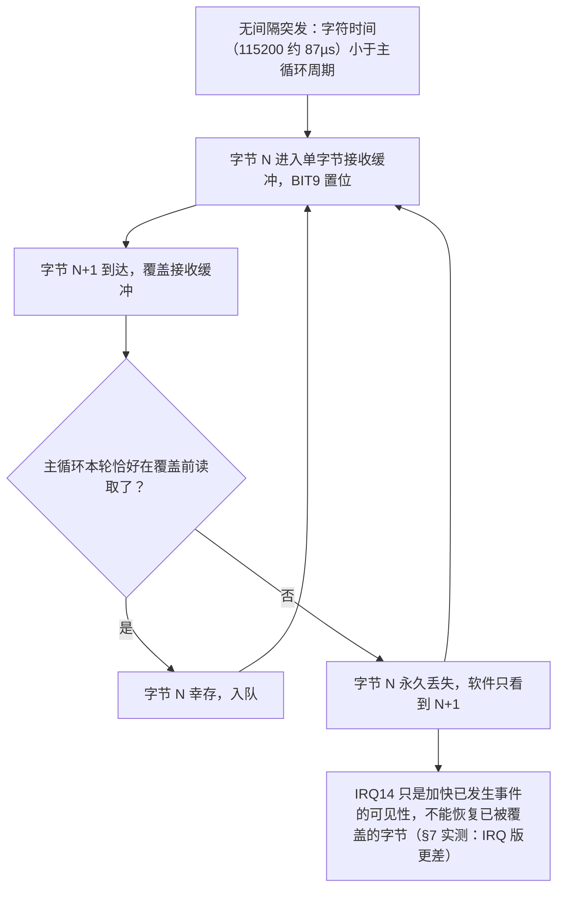

# UART2 RX 修复与板测指南（BT8970 无线麦 SDK）

> 目标：在保留 UART0/PB3 1.5 Mbps 调试口的前提下，为 UART2 建立可验证的 PC→板接收通道。
>
> 当前映射：TX=PE7（TX2-G1），RX=PB1（RX2-G2），波特率由 `UART2_COM_BAUD` 配置。

## 0. 编写依据

| 类别 | 出处 |
|---|---|
| 驱动实现 | `bsp/bsp_uart2_com.c`（BIT9 轮询顺序迁移自原厂 `bsp/bsp_uart.c:91-106` 的 UART1 ISR：查完成位 → 读 DATA → 清挂起） |
| 寄存器定义 | `include/sfr.h`（UART2CON/UART2DATA/UART2CPND 地址） |
| 原厂资料 | `docs/bt897x无线麦SDK.pdf` 第 48–50 页（PE7/PB1 映射、时钟门控与波特率原则；**未公开** UART2 FIFO/中断细节，故中断实验只能实板验证） |
| 中断实验依据 | `libplatform.a` 反汇编：`uart1_register_isr()` 先置 `UART1CON BIT(2)` 再注册 IRQ14；SDK 无 UART2 注册 API（见 §7） |
| 测试脚本 | `projects/microphone/tests/test-uart2.ps1`（特殊字节/间隔/突发用例与逐字节比对） |
| 实测记录 | 2026-09-08（115200：阻塞回显、非阻塞回显、IRQ14 实验三轮）；2026-09-09（115200/2M/3M 扫描）；均为 CH340 COM17，诊断走 UART0 COM9 |

## 1. 结论与证据等级

### 原厂资料明确支持

原厂文档 `docs/bt897x无线麦SDK.pdf` 第 48–50 页确认：

- 芯片提供 UART0、UART1、UART2 和 HUART，用户可使用 UART1、UART2、HUART。
- UART2 可以参考 SDK 的 `bsp_uart.c` 修改。
- PE7 是 TX2-G1，PB1 是 RX2-G2，属于合法 UART2 复用组合。
- UART 必须打开对应时钟门控，波特率应按所选输入时钟计算。

### 从原厂 UART1 源码迁移的工作假设

`bsp/bsp_uart.c` 的 UART1 ISR 使用以下接收顺序：

1. 检查 `UART1CON & BIT(9)`；
2. 读取一次 `UART1DATA`；
3. 写 `UART1CPND = BIT(9)` 清接收挂起。

UART2 没有公开的 `uart2_register_isr()` API，也没有公开寄存器位说明。因此当前实现先按相同语义在主循环轮询：

```c
if (UART2CON & BIT(9)) {
    data = UART2DATA;
    // data 入软件队列
    UART2CPND = BIT(9);
}
```

这是当前最有原厂源码依据的方案，但仍需实板验证 UART2 的 BIT9 行为。

### 原厂资料没有支持的旧结论

旧版本曾把以下现象写成硬件定论，但原厂 PDF 没有给出相应依据：

- `UART2DATA` 空读必定返回 `0xFF`；
- DATA 是无法区分重复字节的保持寄存器；
- BIT9 不能用于逐字节接收；
- 每轮必须先写 `UART2CPND = 0xFF00`；
- 连续相同字节、`0xFF` 或突发流是硬件固有不可接收。

旧代码本身会主动丢弃 `0xFF` 和与上个字节相同的数据，并在判断事件前清除全部状态，因此旧测试无法证明上述硬件结论。

## 2. 当前实现

相关文件：

- 驱动：`bsp/bsp_uart2_com.c`
- 接口：`bsp/bsp_uart2_com.h`
- 配置：`projects/microphone/config.h`
- 主循环入口：`functions/func.c`
- 初始化入口：`system/system.c`

主要行为：

- 每次主循环只在 `UART2CON BIT(9)` 置位时读取一次 DATA，然后清 BIT9。
- 不按数据值去重，`0x00`、`0xFF` 和连续重复字节均作为合法数据入队。
- 128 字节软件环形缓冲在满时丢弃新字节，并累加 `rx_overflow_count`，不覆盖未读数据。
- 正常模式下 `bsp_uart2_com_process()` 不消费 RX 队列；业务通过 `bsp_uart2_com_get()` 取数。
- `UART2_COM_RX_TEST_EN=1` 时启用二进制原样回显，便于主机逐字节比对。回显先把 RX 数据转入独立 TX 队列，再由非阻塞 TX 状态机逐字节发送；UART2 不输出启动文本、十六进制文本或心跳。
- 测试模式的诊断信息只通过 UART0 输出，包括接收数、BIT9 命中数、软件溢出数、TX 入队/完成/溢出数及关键寄存器快照。

UART2 当前选择 24 MHz XOSC，BAUD 分频据此计算，不依赖系统主频恰好也是 24 MHz。

接收数据通路：



## 3. 接线与配置

| USB-UART | 开发板 |
|---|---|
| TX | PB1 / UART2 RX |
| RX | PE7 / UART2 TX |
| GND | GND |

配置位于 `projects/microphone/config.h`：

```c
#define UART2_COM_EN              1
#define UART2_COM_BAUD            115200
#define UART2_COM_RX_TEST_EN      0
#define UART2_COM_RX_IRQ_TEST_EN  0
```

正常业务配置保持两个测试宏为 0。做二进制回显板测时临时将 `UART2_COM_RX_TEST_EN` 改为 1；只有复现实验性 IRQ14 时才将 `UART2_COM_RX_IRQ_TEST_EN` 改为 1。

UART0/PB3 仍为 SDK 调试输出口，波特率 1.5 Mbps。UART0 和 UART2 应分别连接，避免把 UART0 日志混入 UART2 二进制测试数据。

## 4. 构建与主机测试

构建：

```powershell
cd projects/microphone
powershell -ExecutionPolicy Bypass -NoProfile -File .\build.ps1 -Rebuild
```

查看串口：

```powershell
powershell -ExecutionPolicy Bypass -NoProfile -File .\tests\test-uart2.ps1 -ListPorts
```

先跑低速特殊字节测试：

```powershell
powershell -ExecutionPolicy Bypass -NoProfile -File .\tests\test-uart2.ps1 `
  -Port COM7 -BaudRate 115200 -Case slow-special
```

再跑完整测试：

```powershell
powershell -ExecutionPolicy Bypass -NoProfile -File .\tests\test-uart2.ps1 `
  -Port COM7 -BaudRate 115200 -Case all
```

脚本覆盖：

- 单字节 `00`、`FF`；
- 连续相同字节；
- `00 FF 00 FF`、`55 55 AA AA`；
- `00..FF` 全字节序列，10 ms 与 1 ms 字节间隔；
- 128、129、255、256、257 字节无间隔突发。

每个用例会报告发送长度、接收长度、首个不一致位置、期望值和实际值。

### 测试原理

**回显闭环**：主机发用例 → 固件 UART2 收入环形缓冲 → 原样经 UART2 TX 回发 → 主机逐字节比对。一条链路同时压测 RX 路径与 TX 路径，因此判定"丢在哪一环"必须三方对账：

- 主机收到量 vs 板端 `rx_byte_count`：rx 计数完整而主机缺字节 → 丢在适配器/链路（板端无辜）；
- `rx_byte_count` 本身缺斤且 `rx_ovf=0` → 字节在进入软件前已被硬件覆盖（轮询来不及）；
- `rx_ovf` 增长 → 丢在软件消费不及时。

**用例设计意图**：

| 用例 | 设计意图 |
|---|---|
| `00`/`FF`/连续重复/交替模式 | 防软件按值过滤回归（旧版本曾主动丢弃 0xFF 与重复字节） |
| `00..FF` 全字节序列 | 覆盖全部 256 个值，消除值相关盲区 |
| 10 ms / 1 ms 字节间隔 | 标定轮询吞吐边界（实测可靠边界 = 字节间隔 ≥ 1 ms，与波特率无关） |
| 128~257 字节无间隔突发 | 最坏情况：字符时间远小于主循环周期，考核单字节接收缓冲的覆盖极限 |

**判读规则**：单字节丢失后接收流整体前移，`mismatch` 首个不一致位置即丢失处；期望值与实际值的关系可区分"跳字节"（实收=期望的后续字节）与"比特翻转"（相邻值）。



## 5. 分阶段判定

### 慢速特殊字节全部通过

说明 BIT9 至少可以作为轮询接收事件使用，且旧版本对重复字节与 `0xFF` 的丢弃来自软件算法，不是已证实的硬件限制。

### 慢速单字节也完全收不到

通过 UART0 保存以下信息：

- `UART2CON`
- `UART2CPND`
- `UART2BAUD`
- `FUNCMCON2`
- `rx_pending_count`

若线路和电平已确认，但 BIT9 始终不出现，需要向原厂确认 UART2 RX 完成位、清挂起方法及是否存在未公开的初始化位。不得退回“读取值变化即新字节”的算法。

### 慢速通过、连续流丢包

这表明主循环轮询延迟超过 UART2 的接收保持能力。下一步应向原厂确认：

- UART2 是否接入 `IRQ_UART_VECTOR`；
- UART0/1/2 是否由库内部共享分发；
- UART2 RX 中断使能位；
- 是否存在未公开的 UART2 ISR 注册接口；
- UART2DATA 是否有 FIFO，以及 FIFO 深度。

在确认共享中断分发方式前，不应直接用 `sys_irq_init()` 覆盖 UART 向量。若 SDK 不开放可靠的 UART2 RX 中断，持续无损流应改用原厂明确支持回调/FIFO 的 HUART。

### `rx_overflow_count` 增加

说明硬件收数已进入软件，但业务或测试回显消费不够快。需要提高消费频率、缩短阻塞区，或扩大缓冲；不能把它误判成 GPIO/复用故障。

## 6. 资源与低功耗限制

- `uart2_key_mode()` 会重新占用 UART2/VUSB 资源；进入相关升级/按键模式后，PE7/PB1 的 UART2 COM 配置不能假定仍然有效。
- I2C、SPI、SD、TMR3 等模块可能复用 PB1/PE7，部分 SDK 代码会整值改写 `FUNCMCON2`。打开这些功能前必须重新检查引脚冲突。
- 睡眠代码可能暂时关闭 PB1/PE7 的数字功能。若外部主机需要随时发送，应建立单独唤醒协议或禁止相关睡眠路径。

## 7. 实板测试记录

### 2026-09-08：BIT9 轮询版本，阻塞回显

环境：

- UART0：COM9，1.5 Mbps，用于诊断日志；
- UART2：COM17，115200 bps、8N2，用于二进制回显；
- 测试脚本：`tests\test-uart2.ps1 -Case all -TimeoutMs 5000`。

结果：

- `00`、`FF`、连续四个 `61`、`00 FF 00 FF`、`55 55 AA AA`：全部逐字节通过；
- `00..FF`、10 ms 字节间隔：256/256 通过；
- `00..FF`、脚本 1 ms 间隔：256/256 通过；
- 无间隔 128/129/255/256/257 字节：分别收到 86/90/176/177/178 字节，失败；
- UART0 诊断中 `rx_byte_count == rx_pending_count`，`rx_overflow_count == 0`，旧版 `tx_timeout_count == 0`。

这组结果证明：

1. `UART2CON BIT(9)` 可以作为 UART2 轮询接收事件；
2. 重复字节和 `0xFF` 可以正常接收，旧结论是旧软件过滤造成；
3. 软件环形缓冲没有溢出；
4. 第一版测试回显在收到字节后阻塞等待 TX 完成，显著拉长了 RX 轮询间隔，是无间隔突发丢包的直接软件瓶颈。

随后把测试回显改为非阻塞状态机并重新烧录复测。特殊字节、10 ms 和 1 ms 用例仍全部通过；无间隔 128/129/255/256/257 字节分别收到 93/93/180/184/184 字节。UART0 同时显示 `rx_byte_count == rx_pending_count`、`rx_overflow_count == 0`，且旧版 `tx_byte_count` 与 RX 数相等。与阻塞版相比仅小幅改善，说明主要瓶颈已不是回显等待，而是主循环轮询无法在每个 115200 bps 字符到达时及时读取单字节接收寄存器。

进一步反汇编 `libplatform.a` 后确认：`uart1_register_isr()` 会先置 `UART1CON BIT(2)`，再把回调直接注册到 IRQ14；SDK 没有 UART2 注册 API，也没有二级 UART 分发表。当前工程 UART1 功能宏为开启状态，因此不能直接用仅处理 UART2 的 ISR 覆盖 IRQ14。

实验性共享 IRQ14 版本也已完成实板测试：启动稳定，`UART2CON=0x011100f5`，每个收到的字节均使 `irq`、`pending` 和 `rx` 同步递增，证明 `UART2CON BIT(2)` 确实能使 UART2 通过 IRQ14 进入回调。但无间隔 128/129/255/256/257 字节仅收到 70/70/137/140/136 字节，比非阻塞轮询更差；`rx_overflow_count=0`，且旧版统计中 `rx == pending == irq == tx`。这表明软件只观察到这些 RX 完成事件；可能是接收寄存器在响应前被后续字节覆盖，或存在同优先级/关中断区等时延，缺少 UART2 FIFO 文档时不能进一步定性。IRQ 本身无法恢复软件未观察到的字节。

因此默认将 `UART2_COM_RX_IRQ_TEST_EN` 设回 0，保留已验证更好的轮询实现。实验代码仅用于记录和后续原厂确认，不能作为当前产品方案。

### 2026-09-09：115200 / 2M / 3M 回显扫描（CH340，COM17）

环境与前提：

- **RX 测试全部使用 CH340（COM17），CP210x 未参与任何 RX 测试**（CP210x 仅用于 TX 高速档验证）；
- 固件为 RX 回显模式（`UART2_COM_RX_TEST_EN=1`、TX 测试与 IRQ 实验关闭），由用户逐档修改 `UART2_COM_BAUD` 后本地构建烧录；
- 命令：`.\tests\test-uart2.ps1 -Port COM17 -BaudRate <n> -Case all`。

结果汇总：

| 用例 | 115200 | 2000000 | 3000000 |
|---|---|---|---|
| slow-special（100 ms 间隔特殊字节） | 5/5 通过 | 5/5 通过 | 5/5 通过 |
| all-bytes-10ms | 256/256 | 256/256 | 255/256（第 124 字节丢失） |
| all-bytes-1ms | 256/256 | 256/256 | 255/256（第 213 字节丢失） |
| burst-128 | 69/128 | 30/128 | 25/128 |
| burst-129 | 73/129 | 31/129 | 26/129 |
| burst-255 | 143/255 | 53/255 | 39/255 |
| burst-256 | 145/256 | 52/256 | 44/256 |
| burst-257 | 143/257 | 55/257 | 43/257 |

解读：

1. **带间隔（≥1 ms）流量在 115200 和 2M 全部字节级正确**。RX 可靠边界仍为"字节间隔不小于 1 ms"，该边界以时间衡量，与波特率无关。
2. **3M 下即使 10 ms/1 ms 间隔也各丢 1 字节**，且错误形态为 `0x7C→0x7D`、`0xD5→0xD6`（相邻字节顶替、LSB 翻转特征）。这是 CH340 超规格运行（官方上限 2 Mbps）导致的链路级误码，双向均不可靠；**3M 及以上的 RX 验收必须换高速适配器**，与 TX 侧结论一致。
3. **无间隔突发在所有速率下都受"单字节接收缓冲 + 主循环逐字节轮询"限制**：捕获率 115200 约 54%~57%（随主循环负载波动，2026-09-08 那轮曾到 93/128），2M 约 23% 且首字节已是覆盖残值（`mismatch=0` 处期望 0x0B 实收 0x9F），3M 约 10%~18% 并叠加链路误码。软件队列 `rx_ovf` 始终为 0，丢失发生在硬件覆盖环节，轮询与 IRQ14 两种收法均无法恢复。
4. 脚本判定逻辑经本轮数据复核无误：mismatch 位置与"单字节丢失后整体前移"完全吻合，burst 失败是真实丢字节，不是测试缺陷。

无间隔突发丢字节的机理（为什么轮询与 IRQ14 都无法恢复——字节在软件看到之前已被硬件覆盖）：



## 8. 当前验收状态

- 源码已通过完整命令行构建。
- BIT9 轮询、特殊字节、重复字节及脚本 1 ms 间隔数据已通过实板验证（115200、2M，CH340）。
- CH340 链路上 RX 验收上限为 **2M**（与 TX 一致）；3M 起带间隔流量也出现字节级误码，属适配器超规格。
- UART2 IRQ14 和 `CON BIT(2)` 已由实板证明可触发，但不改善无间隔连续流，并可能覆盖 UART1 的 IRQ14 注册，默认禁用。
- 无间隔连续流在当前"主循环逐字节轮询"实现下所有速率都会丢字节（单字节接收缓冲所致），属实现边界而非脚本或链路问题。需要突发/连续流能力时的路径：受限排空式轮询优化，或改用带 FIFO 和专用中断的 HUART，或取得原厂 UART2 FIFO/中断资料后重新设计。
- 下一步可用逻辑分析仪（Saleae Logic，工具链见 `projects/microphone/tests/README.md` 与 [../tool/ai_control_software_principles.md](../tool/ai_control_software_principles.md)）直接抓 PB1：在无间隔突发用例中同步观测 RX 线上实际到达的字节序列，区分"硬件覆盖前字节已到达"与"线上波形本身异常"，把第 7 节"丢失发生在硬件覆盖环节"的推断升级为波形级证据。TX 侧已于 2026-09-09 用同一方法完成 3M 逐位验证（见 [uart2_tx_bringup.md](uart2_tx_bringup.md) 逻辑分析仪独立验证一节）。
