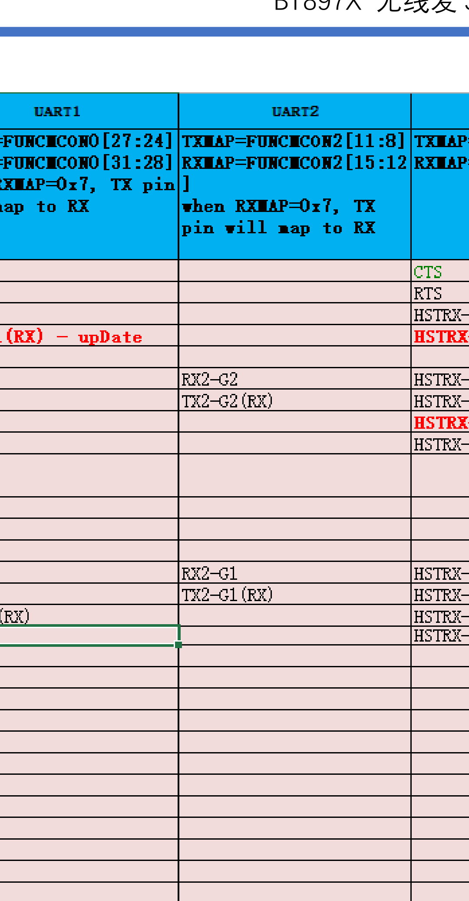
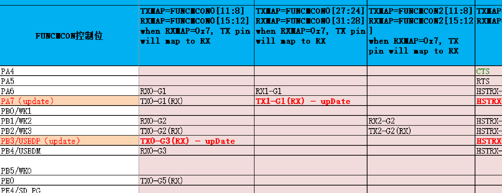
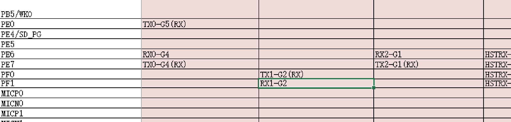
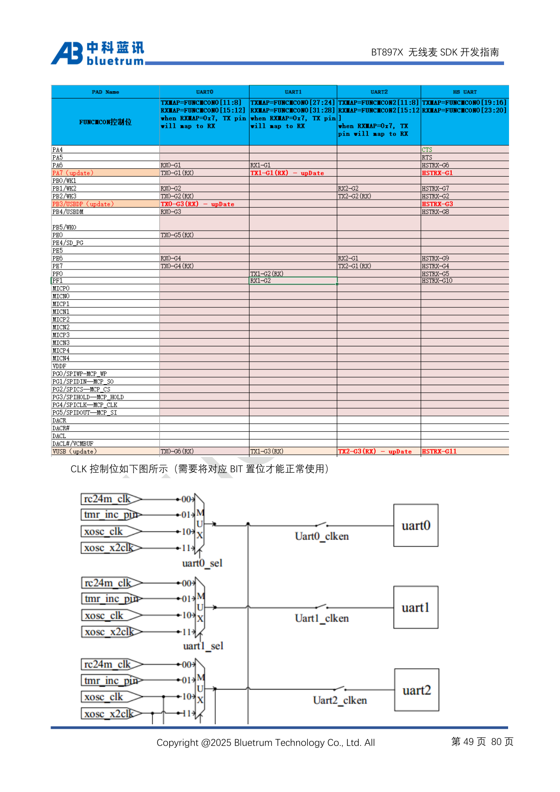
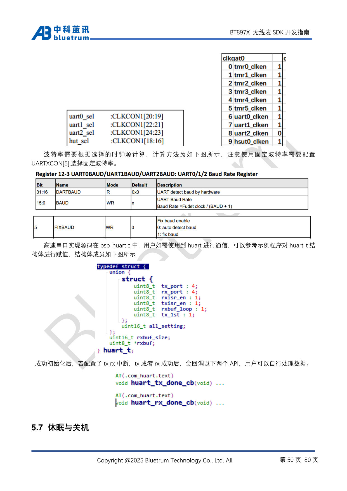
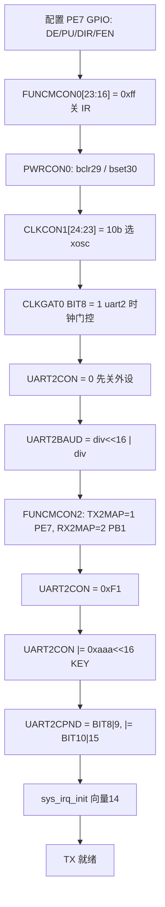
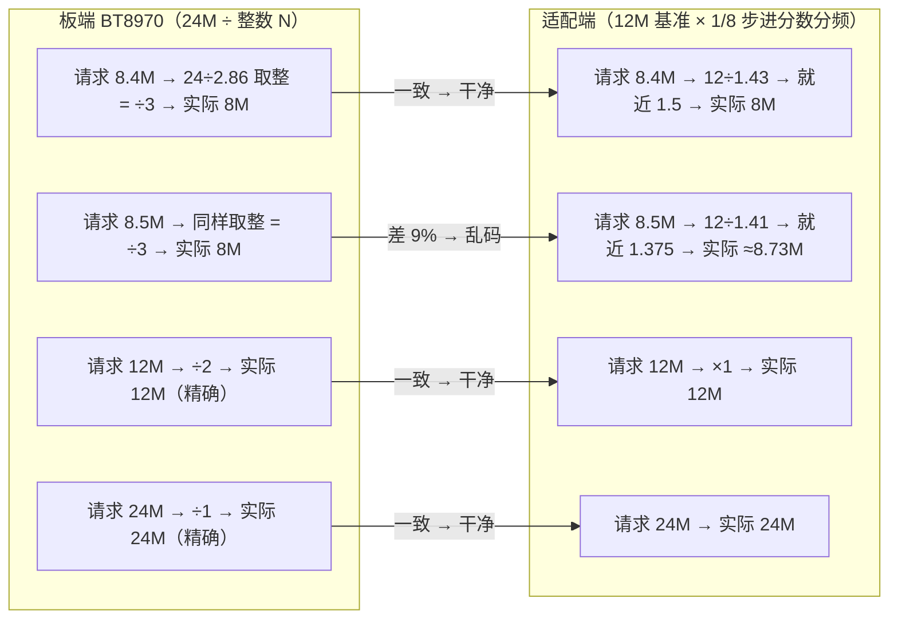

# UART2 普通 TX 调通全流程（BT8970 无线麦 SDK）

> 目标：在 BT8970 上新增一路**普通串口**（非高速 HUART）的发送通道，TX=PE7，并实测其波特率上限。
> 最终结论：**TX 实测无误码上限 = 24 Mbps（= 系统主频 24MHz，分频系数 0 的物理上限）**，115200 / 2M / 3M / 8M / 12M / 24M 全部抓包验证通过。
> 本文只覆盖 TX；RX 调试见文末"状态备注"。

---

## 1. 芯片资源与选型

| 资源 | 说明 | 依据 |
|---|---|---|
| UART0 | 调试打印专用，1.5M 固定 | 手册 5.6.4；实测使能态写 BAUD/CPND 会总线挂死，**不可挪用** |
| UART1 | SDK 官方驱动 `bsp_uart.c`，但引脚硅固化：仅 PA7/PF0/VUSB，且只有一线模式（RXMAP=0x7） | `bsp_uart.h` 枚举 + `bsp_uart.c:154` |
| UART2 | 手册明确"用户可使用"，映射域独立（FUNCMCON2），**本项目选它** | 手册 5.6.4 |
| HUART | 高速串口（HSUT），非本项目目标 | 手册 5.6.4 |

引脚复用（手册 5.6.4 总表，UART2 列）：

| 引脚 | UART2 功能 |
|---|---|
| PE6 | RX2-G1 |
| PE7 | **TX2-G1**（一线模式下兼作 RX） |
| PB1/WK2 | RX2-G2 |
| PB2/WK3 | TX2-G2（一线模式下兼作 RX） |
| VUSB | TX2-G3 / RX2-G3 |







结合开发板只引出 PB0~PB5、PE4、PE7 的约束，选定 **TX=PE7（TX2-G1）+ RX=PB1（RX2-G2）**。

---

## 2. 关键寄存器手册（含依据来源）

### 2.1 引脚映射 FUNCMCON2（0x388）

- `TX2MAP = FUNCMCON2[11:8]`：1=PE7，2=PB2，3=VUSB，**0xF=禁用**
- `RX2MAP = FUNCMCON2[15:12]`：1=PE6，2=PB1，3=VUSB，0x7=一线（TX pin will map to RX），**0xF=禁用**
- 依据：手册复用表表头（下图）+ 官方 demo 反汇编中 `FUNCMCON2 = 0x3300`（G3/G3=VUSB，加密狗用法）
- **实测坑：映射域写 0 不清除**，0xF 才是禁用码（参考 `system.c:267`、`vusb_test.c:149` 的"clear"写法）

### 2.2 时钟：CLKCON1[24:23] + CLKGAT0 BIT(8)

- `uart2_sel = CLKCON1[24:23]`：00=rc24m、01=tmr_inc、10=xosc、11=xosc_x2；官方 demo 取 10（xosc）
- `CLKGAT0 BIT(8) = uart2_clken`，复位默认 0（其余 UART 位默认 1）
- 依据：手册 50 页（"波特率需要根据选择的时钟源计算……需要将对应 BIT 置位才能正常使用"）+ demo 反汇编（对 CLKCON1 做 `bclr23`、`bclr24`、`bset24`，对 CLKGAT0 `|= 0x100`）
- 实测补充：本 SDK 上电后 CLKGAT0 已被置为 0xffffffff（时钟全开），但为可移植性仍显式置位

各 UART 的时钟源选择与门控结构（手册 49 页图，每个 UART 独立 4 选 1 + clken 开关）：





### 2.3 UART2CON（0x1BC）位定义

| 位 | 含义 | 依据 |
|---|---|---|
| BIT(0) | 模块使能 | 手册 + uart1 同款 |
| BIT(4) | 2 停止位 | `bsp_uart.c:156` 注释 |
| BIT(5) | FIXBAUD（0=自动测波特率，1=固定） | 手册 50 页寄存器表 |
| BIT(6) | **TX 使能（实测修正）**——官方注释写 "One line" 有误导；清掉此位引擎直接不发送 | 实验：CON=0xB1 无输出、0x71/0xF1 正常 |
| BIT(7) | RX 采样使能 | `bsp_uart.c:156` 注释（"RX EN"） |
| BIT(8) | TX 完成标志，**复位值 0，发完一字节才置 1** | 实验（先等后写会死等） |
| BIT(9) | RX 完成标志 | `bsp_uart.c` uart1_isr 同构 |
| [27:16] | **KEY 区：必须写 0xaaa**（KEY RESET MODE），读回值不等于写入值（非普通 RW） | `bsp_uart.c:157` + demo 反汇编 `c.or a4,a3`（a3=0x0aaa0000）双重印证 |

> ★ **KEY RESET MODE 是本项目最大的暗坑**：不写这把"钥匙"，FUNCMCON2 的映射接不到焊盘。官方 demo（`uart2_key_mode`）与官方 uart1 驱动（`bsp_uart.c:157`）都有这一步，且**每次重写 CON 后都要补**。

### 2.4 UART2BAUD（0x1C4）

- 格式 `(div << 16) | div`，`Baud = 时钟源频率 / (div + 1)`，[31:16] 为硬件自动测波特率只读区
- 库值验证：1.5M=0xf000f（div=15）、115200=0xcf00cf（div=207@24M）
- div 计算式（本驱动实现）：`div = (sysclk + baud/2) / baud - 1`（四舍五入）
- **整数分频 → 只有 24M/N 的档位是零误差的**（N=1,2,3,4,6,12,48…），其余档位有固有误差（如 460800/921600 误差 0.16%）
- **使能态写 BAUD 会挂死总线**（UART0 上 6 轮复位换来的教训），必须先 `UART2CON=0`

### 2.5 UART2CPND（0x1C0）与 UART2DATA（0x1C8）

- CPND：BIT(8)/BIT(9) 为 TX/RX 挂起标志，**写 1 清除**；官方初始化还会 `|= BIT(10) | BIT(15)`（语义未文档化，照抄官方序列）
- DATA：读=接收缓冲、写=发送缓冲

### 2.6 PWRCON0（0x210）BIT(29)/BIT(30)

- BIT(30) = "Enable VUSB GPIO"（`bsp_uart.c:137` 注释），官方 uart2 demo 序列的一部分
- BIT(29) 由 demo 清 0（配套动作）
- 本项目照抄官方序列（MUSIC_SDCARD_EN=0、无 VUSB 功能，实测无副作用）

### 2.7 引脚 GPIO

TX 脚按 `system.c` 的 uart0 PE7 模板：`GPIOEDE/PU/DIR/FEN |= BIT(7)`（DIR 配输入，由外设驱动输出）。

---

## 3. 初始化序列与依据

最终代码（摘自 `bsp/bsp_uart2_com.c`，RX 引脚与回显部分按需裁剪）：

```c
// 1. TX 引脚 PE7（仿 system.c uart0 PE7 模板）
GPIOEDE  |= BIT(7);
GPIOEPU  |= BIT(7);
GPIOEDIR |= BIT(7);      // input，TX 脚由外设驱动
GPIOEFEN |= BIT(7);

// 2. 时钟/电源（官方 uart2_key_mode 序列，反汇编逐条解码）
FUNCMCON0 = (FUNCMCON0 & 0xff00ffff) | (0xff << 16);  // 关 IR 等映射（保留 [15:0]）
PWRCON0  &= ~BIT(29);
PWRCON0  |= BIT(30);                                  // Enable VUSB GPIO
CLKCON1  &= ~(BIT(23) | BIT(24));                     // uart2_sel = CLKCON1[24:23]
CLKCON1  |= BIT(24);                                  // 选 xosc 时钟源
CLKGAT0  |= BIT(8);                                   // uart2_clken

// 3. 外设（先关再配）
UART2CON = 0;                                         // ★使能态写 BAUD 会挂总线
UART2BAUD = (div << 16) | div;                        // div = (sysclk + baud/2)/baud - 1

// 4. 引脚映射：TX2=PE7(G1)，RX2=PB1(G2)
FUNCMCON2 = (FUNCMCON2 & ~0xff00) | (1 << 8) | (2 << 12);

// 5. 使能 + KEY + 挂起
UART2CON = BIT(7) | BIT(6) | BIT(5) | BIT(4) | BIT(0); // RX EN, TX EN, fixbaud, 2stop, EN
UART2CON |= 0xaaa << 16;                               // ★KEY RESET MODE
UART2CPND = BIT(8) | BIT(9);
UART2CPND |= BIT(10) | BIT(15);                        // 官方同款，语义未文档化

sys_irq_init(IRQ_UART_VECTOR, 0, uart2_com_isr);       // IRQ 14 为 uart0/1/2 共享
```

每一步依据汇总：

| 步骤 | 依据来源 |
|---|---|
| 引脚 GPIO 模板 | `system.c` uart0_mapping_sel PE7 分支 |
| PWRCON0 / FUNCMCON0 / CLKCON1 / CLKGAT0 | 官方 `uart2_key_mode`（libplatform.a/uart.o @0x10030b7a）反汇编，xbs1 自定义位指令 `p.bset/p.bclr` 用工具链编译对照法逐条解码 |
| 先 `UART2CON=0` 再写 BAUD | UART0 使能态写 BAUD 总线挂死的实测教训 |
| FUNCMCON2 映射值 | 手册复用表 + 官方 demo 写 0x3300 的编码方式互证 |
| KEY `0xaaa<<16` | `bsp_uart.c:157`（uart1 官方驱动，"KEY RESET MODE"）+ demo 反汇编双重印证 |
| CPND 序列 | `bsp_uart.c:158-159` 与 demo 反汇编一致 |

初始化流程图：



---

## 4. TX 发送时序

```c
static u8 uart2_com_tx_byte(u8 ch)
{
    u32 tmo = 200000;
    UART2DATA = ch;                     // ★先写后等
    while (!(UART2CON & BIT(8))) {      // TX 完成标志
        if (--tmo == 0) return 0;       // 超时保护
    }
    return 1;
}
```

三条铁律：

1. **先写 DATA、后等 BIT(8)**：完成标志复位值为 0，"先等后写"会死等。
2. **每次重写 CON 后必须补 KEY**（`UART2CON |= 0xaaa << 16`）。
3. **整行组好缓冲后单次 puts 发送**：把 `数字转字符串` 的结果拼进行缓冲并补 `\0`，一次发出。曾因转换函数不补 `\0`、`puts` 越界把**栈上残留字节当字符发出**（帧中间插半固定乱码），教训见第 5.3 节。

---

## 5. 调试历程（按时间线，全部有日志/截图佐证）

### 5.1 UART0 方案废弃
最初按"测试口=打印口"思路复用 UART0（TX=PB3/RX=PB4），6 轮 WDT 复位后定位：**UART0 是 ROM 调试口（1.5M 固定），使能态写 BAUD/CPND 直接挂死总线**。手册 5.6.4 明确 uart0 为调试专用后转 UART2。

### 5.2 UART2 起步：复位与无输出
- 早期复位：CON 读改写 + 中断无人清理 → 改为单位置位 + ISR 无条件清挂起
- 发送死等：TX 完成标志复位值为 0 → 改"先写后等"
- 未挂 ISR 时开一线自检 → 中断风暴复位 → 固定先 `sys_irq_init`

### 5.3 KEY 的发现（本项目最有价值的一步）
所有配置（映射/时钟/使能）都"看起来对"但焊盘无输出、环回收不到。逐条反汇编官方 `uart2_key_mode`（130 字节），发现 `UART2CON |= 0x0aaa0000`；随后在 SDK 自带源码 `bsp_uart.c:157` 找到同款 `UART1CON |= 0xaaa << 16  //KEY RESET MODE`，双重印证后补齐，链路立通。
反汇编方法：工具链无 objdump，用 map.txt 符号表定位地址 + capstone 解码标准 RISC-V 指令；官方 xbs1 自定义位指令（`p.bset/p.bclr`）用**编译对照法**解码——写等价 C 用同款 `-march` 编译，逐字节匹配得出"f3=4 置位 / f3=3 清零 / rs2=位号"的编码规律。

### 5.4 乱码三案（TX 链路上的三次误判与真凶）
| 阶段 | 现象 | 排查 | 结论 |
|---|---|---|---|
| 案1 | 帧中间/尾部半固定乱码（`###lH`、`?`） | 换 CON 位组合、关 RX 采样、PB1 驱动高，均无效 | 软件层无关 |
| 案2 | 固定内容行 100% 干净，计数器行就乱 | 差异锁定在"整行单次 puts" vs "多次 puts" | `u32_to_str` 不补 `\0`，`puts` 越界读栈 |
| 案3 | 8.5M/24M 乱码 | 抓包对比比特流 | 双端整数分频双重取整错位（见 6.2），非芯片问题 |

> 案1 曾先后误判为"BIT6 自收回环"、"BIT7 采样干扰"——两次都被对照实验证伪。**教训：换变量实验一次只动一个，且要先排除软件低级错误。**

### 5.5 VUSB 实验的价值
将 uart0 TX（1.5M 打印）与 uart2 RX 同时映射到 VUSB（=USB DP 焊盘经 PHY），uart2 的 RX 完成标志真的置位（poll=1）——证明 **RX 采样通路本身是活的**，同时解释了官方 `uart2_key_mode` 的加密狗设计（uart2 走 USB 线 DP 脚半双工、从机自动波特率）。

---

## 6. 测试原理与方法

### 6.1 抓取与判定
用 `serial-monitor` 技能（pyserial）对适配器口抓取 8~10 秒，判定三要素：

1. **可打印占比** = 100%（有误码即 <90%）
2. **帧节拍**与固件设定一致（500ms/2s 心跳的行数对得上）
3. **计数器连续性**（`#N` 严格递增、无跳变重复）

### 6.2 双端整数分频的双重取整（8.5M 乱码真相）

收发两端各自用自己的基准时钟做整数/分数分频，**只有两端实际合成频率一致时才不乱码**：



要点：

- 请求 8.4M 和 8.5M 时，**板端输出的比特流完全相同**（都是 8M），8.5M 的乱码是适配端自己合成偏了 9%——与芯片无关
- 板端能输出的只有 24M/N 档位；**选测试档位时优先选两端都能精确合成的频率**（8M/12M/24M），"请求值"只是入口，不代表实际波特率

### 6.3 适配器能力边界

| 适配器 | 可用上限 | 依据 |
|---|---|---|
| CH340（COM10） | 3M | 4M/6M 驱动报"设备没有发挥作用"，拒绝配置 |
| 高速适配器（COM6） | 24M | 8M/12M/24M 全部打开并干净接收 |

---

## 7. 测试结果汇总（全部为串口实抓验证）

| 请求波特率 | 芯片实际输出（div） | 适配器 | 结果 |
|---|---|---|---|
| 115200 | 115200（207） | CH340 | ✅ 干净 |
| 2000000 | 2M（11） | CH340 | ✅ 干净 |
| 3000000 | 3M（7） | CH340 | ✅ 干净 |
| 4000000 | 4M（5） | CH340 | ⛔ 驱动拒绝配置（适配器上限 3M） |
| 8400000 | **8M**（2，取整） | 高速 | ✅ 干净 |
| 8500000 | **8M**（2，同一比特流） | 高速 | ❌ 乱码（适配端合成偏差，见 6.2） |
| 12000000 | **12M**（1） | 高速 | ✅ 干净 |
| 24000000 | **24M**（0，物理上限） | 高速 | ✅ 干净 |

> 18M 无法实现：24÷18=1.33，整数分频器无此档。

---

## 8. 附录

### 8.1 证据日志（docs/ 下）

| 文件 | 内容 |
|---|---|
| `uart2_2m.log` / `uart2_3m.log` | CH340 上 2M/3M 干净抓取 |
| `uart2_4m.log` | CH340 4M 配置被拒的现场 |
| `uart2_8m4b.log` / `uart2_8m5.log` / `uart2_12m.log` / `uart2_24m_b.log` | 高速适配器 8M/8.5M/12M/24M 抓取 |
| `uart2_rx_test1/2.log`、`uart2_rx_loop.log`、`uart2_rx_hunt*.log` | RX 排查过程数据 |

### 8.2 相关源文件

| 文件 | 作用 |
|---|---|
| `bsp/bsp_uart2_com.c` | 本驱动（含全部结论注释） |
| `bsp/bsp_uart.c:151-160` | 官方 uart1 初始化（KEY/CPND 序列参照） |
| `include/config_define.h:171-182` | UART0 映射宏（映射域编码规律参照） |
| `include/sfr.h:81-92,134-139,168-173` | UARTx / CLKGATx / FUNCMCONx 寄存器地址 |
| `projects/microphone/config.h:37-38` | `UART2_COM_EN` / `UART2_COM_BAUD` 宏 |
| `system/system.c`（UART2_COM_EN 块） | 初始化挂载点 |
| `functions/func.c`（func_process 开头） | 轮询挂载点 |

### 8.3 官方 demo 反汇编要点（libplatform.a/uart.o @ 0x10030b7a，0x82 字节）

```text
FUNCMCON0 = 0x00ff0000                 ; 关 IR 等 [23:16] 映射
PWRCON0   : p.bclr 29; p.bset 30       ; xbs1 自定义位指令
CLKCON1   : p.bclr 23; p.bclr 24; p.bset 24   ; uart2_sel = 10b (xosc)
CLKGAT0  |= BIT(8)
UART2CON  = 0
FUNCMCON2 = 0x3300                     ; TX2/RX2 = G3/G3 (VUSB，加密狗)
UART2BAUD = 0x00cf00cf
UART2CON  = 0xd1
UART2CON |= 0x0aaa0000                 ; ★KEY RESET MODE
UART2CPND = 0x300; |= 0x400; p.bset 15
```

demo 的 CON=0xd1 未含 BIT(5)，即**从机自动波特率**模式（加密狗由主机先发起通信）。

---

## 9. RX 状态备注（已完结，另见专文）

RX 已通过 **uart0@PB1@115200（保持寄存器轮询模型）** 调通；uart2 自身 RX 的芯片级异常证据链与 FAE 问题单见 **[uart2_rx_bringup.md](uart2_rx_bringup.md)**。
