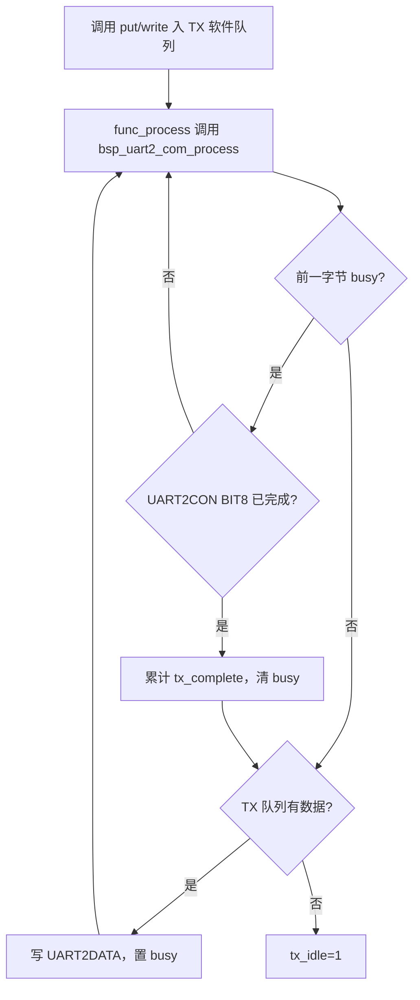

# UART2 TX 调通与使用指南（BT8970 无线麦 SDK）

> 本文说明普通 UART2 的发送路径。当前工程映射为 TX=PE7（TX2-G1）、RX=PB1（RX2-G2），UART0/PB3 继续作为 1.5 Mbps 调试口。
>
> 证据分为：**原厂 PDF 明确**、**SDK 源码/静态库明确**、**本项目实测**和**待原厂确认**。没有量化数据的实验不表述为芯片规格。

## 1. 已确认结论

### 原厂 PDF 明确

`docs/bt897x无线麦SDK.pdf` 第 48–50 页确认：

- 芯片有 UART0、UART1、UART2 和 HUART；用户可使用 UART1、UART2、HUART。
- UART2 可参考 SDK 的 UART1 驱动修改。
- PE7 对应 TX2-G1，PB1 对应 RX2-G2。
- UART 有独立时钟选择和门控，波特率必须按所选输入时钟计算。

### SDK 源码和静态库明确

- UART2 寄存器地址定义于 `include/sfr.h`。
- 原厂 `uart1_putchar()` 的发送顺序是：写 `UART1DATA`，再等待 `UART1CON BIT(8)`；逐字节发送不写 CPND。
- 原厂 UART1 初始化使用 `BIT(7)|BIT(6)|BIT(5)|BIT(4)|BIT(0)`、`0xaaa<<16` KEY，以及 BIT8/9/10/15 的 CPND 初始化序列。
- `uart2_key_mode()` 的反汇编显示 UART2 时钟门控、BAUD、CON、KEY 和 CPND 初始化结构与 UART1 同构，但它把 TX/RX 映射到 VUSB，并非本项目的 PE7/PB1 通信模式。

### 当前工程实现

- UART2 输入时钟选择为 24 MHz XOSC，而不是跟随 CPU 系统时钟。
- TX 使用 128 字节软件队列；`bsp_uart2_com_process()` 检查 BIT8 后提交下一个字节，不阻塞主循环。
- 公开接口为：

```c
u8  bsp_uart2_com_put(u8 ch);
u16 bsp_uart2_com_write(const u8 *buf, u16 len);
u8  bsp_uart2_com_tx_idle(void);
```

`put()` 返回 1 表示成功入队，返回 0 表示队列已满；`write()` 返回实际入队长度。调用者必须保证主循环持续执行 `bsp_uart2_com_process()`。`tx_idle()` 会直接检查 BIT8 并收割最后一个字节的完成状态，因此可用于切换资源前的带超时等待；等待期间仍应持续调用 `bsp_uart2_com_process()`，以便发送队列继续前进。

## 2. 引脚与资源

| 信号 | 映射 | 当前引脚 |
|---|---|---|
| UART2 TX | TX2-G1 | PE7 |
| UART2 RX | RX2-G2 | PB1/WK2 |
| 调试串口 TX | UART0 | PB3 |

接线：USB-UART RX 接 PE7，GND 共地。做收发回显测试时，USB-UART TX 还需接 PB1。

可能冲突的功能包括 VUSB `uart2_key_mode()`、HUART、I2C、SPI、SD、TMR3、ADKEY、按键和 MIC power。部分 SDK 模块会整值写 `FUNCMCON2`，启用新外设后必须重新核对映射。

睡眠代码可能关闭 PB1/PE7 数字功能，因此 UART2 不能默认作为睡眠期间持续工作的通信通道。产品若要求随时接收，应禁止相关睡眠、增加唤醒握手，或改用合适的唤醒引脚和重发协议。

## 3. 初始化依据

当前关键初始化位于 `bsp/bsp_uart2_com.c`：

```c
CLKCON1 &= ~(BIT(23) | BIT(24));
CLKCON1 |= BIT(24);                 // 选择 24 MHz XOSC
CLKGAT0 |= BIT(8);                  // 打开 UART2 时钟门控

UART2CON = 0;
UART2BAUD = (div << 16) | div;
FUNCMCON2 = (FUNCMCON2 & ~0xff00) | (1 << 8) | (2 << 12);
UART2CON = BIT(7) | BIT(6) | BIT(5) | BIT(4) | BIT(0);
UART2CON |= 0xaaa << 16;
UART2CPND = BIT(8) | BIT(9);
UART2CPND |= BIT(10) | BIT(15);
```

证据边界：

| 配置 | 结论 |
|---|---|
| BIT0 | UART enable，来自原厂 UART1 源码 |
| BIT4 | 原厂 UART1 注释为 2 stop bits；当前主机测试按 8N2 配置 |
| BIT5 | fixed baud，原厂 PDF 第 50 页和 UART1 源码支持 |
| BIT6 | 原厂 UART1 注释为 One line；UART2 历史实验表明当前 TX 配置需要此位，精确语义待原厂确认 |
| BIT7 | 原厂 UART1 注释为 RX enable；UART2 RX 实测需要 |
| BIT8 | TX complete；原厂 `uart1_putchar()` 的发送判据 |
| BIT9 | RX complete；UART1 源码与 UART2 实板测试支持 |
| BIT2 | RX IRQ enable；由 `uart1_register_isr()` 反汇编类推，并经 UART2 实板验证可触发 IRQ14，但默认禁用 |
| `[27:16]` | 原厂源码称 KEY RESET MODE；缺少 KEY 时的精确影响范围未公开 |

对 UART2CON 做整值赋值时必须包含 KEY 初始化步骤；保留 KEY 位的读改写不需要重复添加。

初始化前关闭 UART2 再写 BAUD，是与原厂 UART1 初始化一致的保守顺序。早期 UART0 运行时重配曾伴随 WDT 复位，但不能据此断言 UART2 使能态写 BAUD 必然挂死。

## 4. 波特率

当前时钟源为 24 MHz XOSC：

```text
div = round(24,000,000 / requested_baud) - 1
actual_baud = 24,000,000 / (div + 1)
```

| 请求值 | div | 推算实际值 | 误差 |
|---:|---:|---:|---:|
| 115200 | 207 | 115384.615 | +0.1603% |
| 460800 | 51 | 461538.462 | +0.1603% |
| 921600 | 25 | 923076.923 | +0.1603% |
| 1500000 | 15 | 1500000 | 0% |
| 2000000 | 11 | 2000000 | 0% |
| 3000000 | 7 | 3000000 | 0% |
| 4000000 | 5 | 4000000 | 0% |
| 8000000 | 2 | 8000000 | 0% |
| 12000000 | 1 | 12000000 | 0% |
| 24000000 | 0 | 24000000 | 0% |

驱动拒绝 0 或高于当前 24 MHz 输入时钟的请求。请求值不一定等于实际值，例如请求 8.4M 或 8.5M 都会量化为 8M。

24 Mbps 只是**当前选择 24 MHz XOSC、div=0 时的最大可编程档位**，不是 UART2 IP 的绝对物理上限。PDF 还展示了 XOSC×2 时钟选择，但本工程没有配置或验证该模式。

## 5. TX 发送流程



示例：

```c
static const u8 msg[] = "uart2 ready\r\n";

if (bsp_uart2_com_write(msg, sizeof(msg) - 1) != sizeof(msg) - 1) {
    // 队列空间不足；稍后重试剩余字节
}
```

`tx_queued_count` 表示成功进入软件队列的字节数，`tx_complete_count` 表示观察到 BIT8 完成的字节数，`tx_overflow_count` 表示因队列满而拒绝的字节数。

## 6. 构建和 TX 验证

构建：

```powershell
cd projects/microphone
powershell -ExecutionPolicy Bypass -NoProfile -File .\build.ps1 -Rebuild
```

产物：`projects/microphone/Output/bin/app.dcf`。

当前仓库的历史 TX 日志可证明的范围有限：

| 日志 | 可支持的结论 |
|---|---|
| `docs/uart2_2m.log` | 2 Mbps 请求下捕获到 20 行连续可读计数文本 |
| `docs/uart2_3m.log` | 3 Mbps 请求下捕获到短时连续可读文本 |
| `docs/uart2_8m4b.log` | 8.4 Mbps 请求下捕获到短时可读文本；板端按公式实际为 8 Mbps |
| `docs/uart2_8m5.log` | 8.5 Mbps 请求下出现乱码；不能据此单独断言错误只来自适配器 |
| `docs/uart2_12m.log` | 12 Mbps 请求下捕获到短时可读文本 |
| `docs/uart2_24m_b.log` | 24 Mbps 请求下捕获到少量可读心跳和测试字符串 |

这些日志没有固定测试向量、总字节数、CRC、持续时间、适配器型号和逻辑分析仪测量，因此只能证明“该次短文本捕获可读”，不能证明“长期无误码”或“硬件极限”。

完整 TX 验收应记录：

1. 固件 Git commit 和 `app.dcf` SHA256；
2. USB-UART 型号、驱动版本、电平和帧格式；
3. 请求波特率、推算实际波特率，必要时测量 bit time；
4. 固定二进制向量、总字节数和 CRC32/SHA256；
5. 丢失、重复、错位计数和测试持续时间；
6. 原始二进制结果，而不是只判断“文本看起来正常”。

## 7. 与 RX 的关系

当前 `UART2_COM_RX_TEST_EN=0`，业务 RX 队列不会被测试回显消费。需要回显验证时临时改为 1，重新构建和烧录，然后使用 `test-uart2.ps1`。

独立 TX 测试使用 `UART2_COM_TX_TEST_EN=1`。固件每 100 ms 发送一个 72 字节二进制帧：`55 AA 5A A5` 同步头、16 位递增序号、64 字节确定性 payload，以及 CRC-16/MODBUS。主机使用以下命令连续校验帧长度、序号、payload 和 CRC：

```powershell
powershell -ExecutionPolicy Bypass -NoProfile -File .\test-uart2-tx.ps1 `
  -Port COM17 -BaudRate 115200 -FrameCount 100
```

测试完成后应将 `UART2_COM_TX_TEST_EN` 恢复为 0，避免测试流量占用业务 TX 队列。

### 115200 bps 独立 TX 实板结果（2026-09-08）

测试环境：

- UART2 TX：PE7 → COM17 RX；
- UART0 debug：PB3 → COM9；
- 串口格式：115200 bps、8N2；
- 固件每 100 ms 发送一个 72 字节测试帧；
- 主机命令：`test-uart2-tx.ps1 -Port COM17 -BaudRate 115200 -FrameCount 100 -TimeoutMs 20000`。

主机校验结果：

```text
valid=100/100
first=329
last=428
crc_errors=0
payload_errors=0
sequence_errors=0
discarded_bytes=0
elapsed_ms=9958
```

UART0 同期统计持续满足：

```text
tx_q == tx_done
tx_ovf == 0
rx == pending == irq == 0
UART2CON  = 0x111101f1
UART2CPND = 0x00000000
UART2BAUD = 0x00cf00cf
FUNCMCON2 = 0x00002100
```

因此可以确认：当前 24 MHz XOSC、`div=207`、8N2 配置下，UART2 TX 在 115200 请求波特率（推算实际约 115384.615 bps）连续发送 100 个测试帧、共 7200 字节时，主机未检测到丢帧、重复、乱序、payload 错误或 CRC 错误。该结论只覆盖本次硬件、适配器和测试时长，不自动证明更高波特率或无限持续时间无误码。

测试后源码已恢复 `UART2_COM_TX_TEST_EN=0`；板上仍运行测试固件时会继续输出测试帧，烧录最终默认固件后停止。

### CH340 3M 超规格实测（2026-09-09，COM17，已修正旧结论）

背景：本节早年的历史日志曾记录"CH340 3M 干净"，但当时每次只有十几字节的短文本行。用 72 字节突发帧重新考核：

- 板端：`UART2_COM_BAUD=3000000`，UART0 诊断确认 `baud=00070007`（24 MHz/8，精确 3.000 Mbps），且 `tx_q == tx_done`、`tx_ovf=0`，即板端把每个字节都完整发出；
- 主机 CH340 接收两轮：第 1 轮 `crc_errors=5`、`sequence_errors=5`、`discarded_bytes=355`（约 5/109 帧丢失）；第 2 轮 `crc_errors=2`、`sequence_errors=2`、`discarded_bytes=141`（约 2/104 帧）。

结论修正为：

- CH340 官方规格上限 2 Mbps，3M 属超规格运行；
- 短文本行（旧日志场景）侥幸可读，72 字节突发下有 2%~5% 帧级损坏/丢失；
- 板端发送路径逐字节等待 BIT8 完成，硬件上不可能跳过字节，丢失发生在 CH340 适配器或链路上；
- **3M 及以上速率的 TX 验收不能以 CH340 为准**。

### CP210x 高速适配器波特率扫描（2026-09-09，COM6）

CH340 更换为 Silicon Labs CP210x 适配器（Windows 设备名 `Silicon Labs CP210x USB to UART Bridge`，与调试口 COM9 同款）后，逐档修改 `UART2_COM_BAUD`、重新构建并烧录，主机逐字节校验：

| 请求波特率 | 板端 div | 推算实际值 | valid | crc_errors | payload_errors | sequence_errors | discarded_bytes | elapsed_ms | 结果 |
|---:|---:|---:|---:|---:|---:|---:|---:|---:|---|
| 3000000 | 7 | 3.000 Mbps | 100/100 | 0 | 0 | 0 | 0 | 9972 | 通过 |
| 8000000 | 2 | 8.000 Mbps | 100/100 | 0 | 0 | 0 | 0 | 10014 | 通过 |
| 12000000 | 1 | 12.000 Mbps | 100/100 | 0 | 0 | 0 | 0 | 9987 | 通过 |
| 24000000 | 0 | 24.000 Mbps | 100/100 | 0 | 0 | 0 | 0 | 9997 | 通过 |

每轮烧录后序号从 0 重启，`first/last` 区间长度均为 100，与帧数一致。每档验证 100 帧 = 7200 字节、约 10 秒，命令格式：

```powershell
.\test-uart2-tx.ps1 -Port COM6 -BaudRate <请求波特率> -FrameCount 100 -TimeoutMs 20000
```

结论与边界：

1. 在当前 CP210x 实物链路上，3M/8M/12M/24M 四档均做到字节级零丢失、零错序、零 CRC 错误；加上此前 115200（CH340），TX 已验证 115200 与 3M/8M/12M/24M。
2. CP210x 家族公开数据手册中多数型号的速率上限在 1~3 Mbps 量级，本次 8M/12M/24M 已高于公开规格；连续 100 帧零误码证明当前实物可用，但量产签核前建议用逻辑分析仪实测线速并做长时间误码考核。
3. 每档仅 100 帧/约 10 秒，验证的是"该速率链路字节级正确"，不等于长时间误码率指标。
4. 测试帧每 100 ms 突发一次，平均速率远低于线速。另需注意：驱动 TX 为非阻塞逐字节提交，连续大流量发送时的实际吞吐受主循环 `bsp_uart2_com_process()` 调用频率限制，连续流场景应先评估主循环周期。


普通 UART2 RX 已确认：特殊字节、重复字节以及脚本 1 ms 间隔均可正确接收；115200 bps 无间隔连续流在轮询和实验性 IRQ14 模式下都会丢包。完整数据和原因分析见 [uart2_rx_bringup.md](uart2_rx_bringup.md)。

`uart2_key_mode()` 会将 UART2 切换至 VUSB 并重写时钟、BAUD、CON 和映射。当前调用路径紧接软件复位；若未来取消复位，必须完整重新初始化 UART2 COM。切换前若有业务 TX，还应先等待 `bsp_uart2_com_tx_idle()`，或明确允许丢弃尾部数据。

## 8. 已推翻或未证实的历史说法

以下内容不再作为实现依据：

- “BIT6 已确定就是 TX enable”：原厂注释为 One line，准确位名待确认。
- “KEY 决定 FUNCMCON2 能否接到焊盘”：只能确认 KEY 属于原厂初始化序列，精确作用范围未知。
- “UART2 使能态写 BAUD 必然挂总线”：现有异常来自 UART0 实验，不能直接外推。
- “IRQ14 是 TX 初始化前置步骤”：TX 使用 BIT8 判据，不需要注册 IRQ。
- “24 Mbps 是系统主频决定的 UART2 物理上限”：它只是当前 24 MHz XOSC 模式的 div=0 档位。
- “可打印占比 100% 就等于无误码”：该方法无法发现可打印字符之间的替换、重复或遗漏。
- “CH340 3M 干净”：旧结论基于十几字节的短文本行；72 字节突发考核下有 2%~5% 帧级丢失（板端已证明完整发送），3M 及以上验收必须使用高速适配器。
- “RX 是 UART0@PB1”：当前 RX 明确是 UART2@PB1，UART0 仍为 PB3 调试口。
